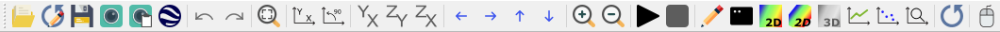
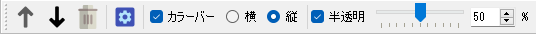
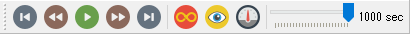

.. _sec_menubar_and_toolbar:

Menu bar and Toolbar
========================

The menu bar and the toolbar have the characters explained below.

Menu bar
---------

The menu bar items change depending on which window is active. The
following menu items are always displayed, regardless the active
subwindow.

-  [File] (F)
-  [Import] (I)
-  [Simulation] (S)
-  [Calculation Results] (R)
-  [View] (V)
-  [Option] (O)
-  [Help] (H)

Additional menu items are inserted depending on the active subwindow.
Added items are inserted between [Import] (I) and [Simulation] (S).

Additional menu items for each subwindow are explained in the sections
shown in :numref:`subwindow_list`.

.. _subwindow_list:

.. list-table:: Sections where the subwindow menu items are explained
   :header-rows: 1

   * - Subwindow
   * - [Pre-processing Window]
   * - [Grid Bird\'s-eye view Window]
   * - [2D Post-processing Window]
   * - [Bird\'s-eye 2D Post-processing Window]
   * - [3D Post-processing Window]
   * - [Graph Window]

Toolbars
---------

The following three toolbars are available:

-  Main Toolbar
-  Operation Toolbar
-  Animation Toolbar

For the functions of each toolbar, refer to :numref:`toolbar_functions`.

.. _toolbar_functions:

.. list-table:: Functions of each toolbar
   :header-rows: 1

   * - Item
     - Functions
     - Displayed when
   * - Main Toolbar
     - Handling of files, canvas display, solver launching and window display
     - Always
   * - Operation Toolbar
     - Operations that are possible for items selected in [Object Browser]
     - When the [Pre-processing Window] is active
   * - Animation Toolbar
     - Moving between timesteps of simulation results
     - When the Post-processing Window or the Graph Window is active

   Main Toolbar

   Operation Toolbar

   Animation Toolbar
