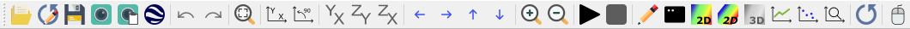
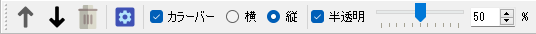
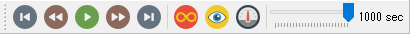
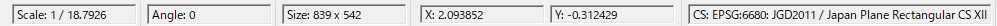
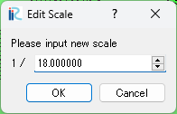
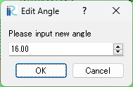
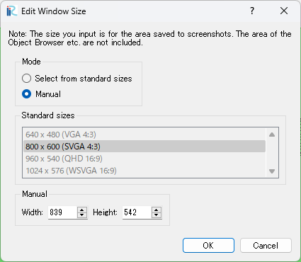
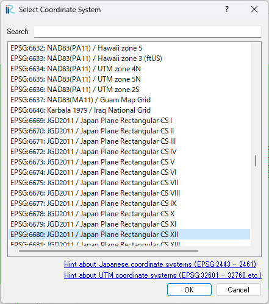

.. _sec_menubar_and_toolbar_status_bar:

Menu bar, Toolbar and Status bar
=====================================

The menu bar and the toolbar have the characters explained below.

Menu bar
---------

The menu bar items change depending on which window is active. The
following menu items are always displayed, regardless the active
subwindow.

-  [File] (F)
-  [Import] (I)
-  [Simulation] (S)
-  [Calculation Results] (R)
-  [View] (V)
-  [Option] (O)
-  [Help] (H)

Additional menu items are inserted depending on the active subwindow.
Added items are inserted between [Import] (I) and [Simulation] (S).

Additional menu items for each subwindow are explained in the sections
shown in :numref:`subwindow_list`.

.. list-table:: Sections where the subwindow menu items are explained
   :name: subwindow_list
   :header-rows: 1

   * - Subwindow
   * - [Pre-processing Window]
   * - [Grid Bird\'s-eye view Window]
   * - [2D Post-processing Window]
   * - [Bird\'s-eye 2D Post-processing Window]
   * - [3D Post-processing Window]
   * - [Graph Window]

Toolbars
---------

The following three toolbars are available:

-  Main Toolbar
-  Operation Toolbar
-  Animation Toolbar

For the functions of each toolbar, refer to :numref:`toolbar_functions`.

.. _toolbar_functions:

.. list-table:: Functions of each toolbar
   :header-rows: 1

   * - Item
     - Functions
     - Displayed when
   * - Main Toolbar
     - Handling of files, canvas display, solver launching and window display
     - Always
   * - Operation Toolbar
     - Operations that are possible for items selected in [Object Browser]
     - When the [Pre-processing Window] is active
   * - Animation Toolbar
     - Moving between timesteps of simulation results
     - When the Post-processing Window or the Graph Window is active

   Main Toolbar

   Operation Toolbar

   Animation Toolbar

Status bar
------------------------

:numref:`image_statusbar` shows an example of status bar.

.. _image_statusbar:

   Status bar

The functions available on status bar are described below.

Scale
~~~~~~~~

Displays the scale of the display in the currently active window.

Clicking on it brings up the dialog shown in :numref:`image_scale_dialog`, where you can change the scale by specifying a value.

.. _image_scale_dialog:

   Scale editing dialog

Angle
~~~~~~

Displays the angle of rotation of the display in the currently active window, defined as 0 when the x-axis is facing right and counterclockwise from there is the positive direction.

Clicking on it will bring up the dialog shown in :numref:`image_angle_dialog` where you can change the angle by specifying a value.

.. _image_angle_dialog:

   Angle editing dialog

Size
~~~~~~~~~

Displays the size of the drawing area in the currently active window.

When clicked, the dialog shown in :numref:`image_windowsize_dialog` will appear, allowing you to resize the window by specifying width and height values.

.. _image_windowsize_dialog:

   Window size editing dialog

.. note:: 
   
   The size displayed and edited by this function is the size of the area in the currently active window where the screenshot will be saved. It does not include the size of the area of the object browser, toolbar, etc.

X, Y
~~~~~~

Displays the position of the mouse cursor in the currently active window.

CS (Coordinate system)
~~~~~~~~~~~~~~~~~~~~~~~~~~~~~~

Displays the coordinate system specified in the currently open project.

Clicking on it will bring up the dialog shown in :numref:`image_coordinatesystem_dialog`, where you can change the coordinate system.

.. _image_coordinatesystem_dialog:

   Select Coordinate System dialog
