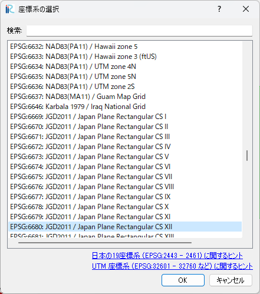

.. _sec_menubar_and_toolbar_and_status_bar:

メニューバー・ツールバー・ステータスバー
===========================================

メニューバー
------------

メニューバーは、アクティブなサブウィンドウによって構成が変化します。
以下のメニューは、サブウィンドウによらず常に表示されます。

-  ファイル (F)
-  インポート (I)
-  計算 (S)
-  計算結果 (R)
-  表示 (V)
-  オプション (O)
-  ヘルプ (H)

アクティブなサブウィンドウによって、追加のメニュー項目が表示されます。
追加項目は、"インポート (I)" と "計算 (S)" の間に追加されます。

サブウィンドウごとに追加されるメニューについては :numref:`subwindow_list`
を参照してください。

.. list-table:: サブウィンドウ固有のメニューの参照先
   :name: subwindow_list
   :header-rows: 1

   * - サブウィンドウ
   * - プリプロセッサー
   * - 格子鳥瞰図ウィンドウ
   * - 可視化ウィンドウ (2D)
   * - 鳥瞰図可視化ウィンドウ (2D)
   * - 可視化ウィンドウ (3D)
   * - グラフウィンドウ

ツールバー
-----------

ツールバーは以下の3つを利用できます。

-  メインツールバー
-  操作ツールバー
-  アニメーションツールバー

各ツールバーの機能などについて、:numref:`toolbar_functions` に示します。

.. _toolbar_functions:

.. list-table:: ツールバーの機能
   :header-rows: 1

   * - 項目
     - 機能
     - 表示される条件
   * - メインツールバー
     - ファイル操作、表示操作、ソルバー起動操作、ウィンドウの表示操作
     - 常時
   * - 操作ツールバー
     - オブジェクトブラウザーで選択した項目について行える操作
     - プリプロセッサーがアクティブ
   * - アニメーションツールバー
     - 計算結果のタイムステップ間の移動
     - 可視化ウィンドウ、グラフウィンドウがアクティブ

   メインツールバー

.. figure:: images/operation_toolbar.png
   :width: 250pt

   操作ツールバー

.. figure:: images/animation_toolbar.png
   :width: 200pt

   アニメーションツールバー

ステータスバー
------------------------

ツールバーの表示例を :numref:`image_statusbar` に示します。

.. _image_statusbar:

   ステータスバー

ステータスバーで利用できる機能を以下に示します。

縮尺
~~~~~~

現在アクティブなウィンドウでの表示の縮尺を表示します。

クリックすると :numref:`image_scale_dialog` に示すダイアログが表示され、縮尺を値を指定して変更することができます。

.. _image_scale_dialog:

   縮尺編集ダイアログ

角度
~~~~~~

現在アクティブなウィンドウでの表示の回転角を表示します。X軸が右向きのときが0で、そこから反時計回りが正の方向として定義されています。

クリックすると :numref:`image_angle_dialog` に示すダイアログが表示され、角度を値を指定して変更することができます。

.. _image_angle_dialog:

   角度編集ダイアログ

サイズ
~~~~~~~~~

現在アクティブなウィンドウでの、描画領域のサイズを表示します。

クリックすると :numref:`image_windowsize_dialog` に示すダイアログが表示され、ウィンドウのサイズを値を指定して変更することができます。

.. _image_windowsize_dialog:

   ウィンドウサイズ編集ダイアログ

.. note:: この機能で表示・編集されるサイズは、現在アクティブなウィンドウでの、スクリーンショットの保存対象となる領域のサイズです。オブジェクトブラウザ、ツールバーなどの表示領域のサイズは含まれません。

X, Y
~~~~~~

現在アクティブなウィンドウでの、マウスカーソルのある位置を表示します。

座標系
~~~~~~~~~

現在開いているプロジェクトで指定された座標系を表示します。

クリックすると :numref:`image_coordinatesystem_dialog` に示すダイアログが表示され、ウィンドウのサイズを値を指定して変更することができます。

.. _image_coordinatesystem_dialog:

   座標系設定ダイアログ
