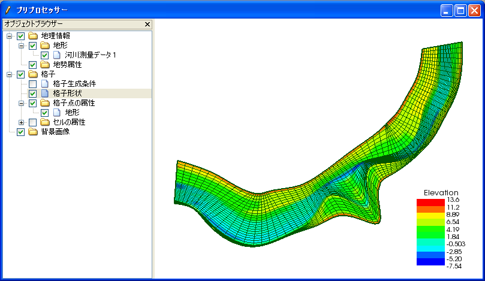

.. _sec_pre_window:

[Pre-processing Window]
===========================

:numref:`image_pre_window` shows an example of the [Pre-processing Window].

.. _image_pre_window:

   [Pre-processing Window]

The [Pre-processing Window] handles the following operations:

-  Importing geographic data
-  Editing geographic data
-  Creating a grid
-  Editing the grid
-  Setting calculation conditions

You can activate [Pre-Processing Window] with either of the following
actions:

**Menu bar:** [View] (V) --> [Pre-processing Window]

**Operation Toolbar:** |pre-window-icon|

Refer to :ref:`chap_pre_window` for detail.
