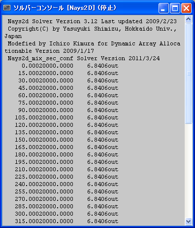
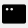
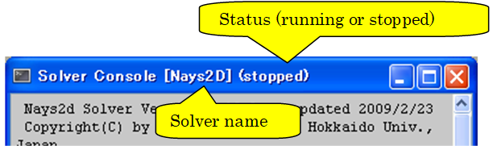

ソルバーコンソール
=====================

ソルバーコンソールの表示例を :numref:`image_solver_console_window` に示します。

.. _image_solver_console_window:

   ソルバーコンソール

ソルバーコンソールでは、計算中にソルバーが標準出力、標準エラーに出力した
メッセージを表示することができます。
ソルバーでの計算の実行を開始すると、自動的にソルバーコンソールが表示されます。

上記以外の時にソルバーコンソールを手動で表示するには、以下のいずれかの操作を行います。

**メニューバー:**  表示 (V) --> ソルバーコンソール

**ツールバー:** |console-window-icon|

ソルバーコンソールでは、ウィンドウのタイトルに、ソルバーの名前と実行状態が
表示されます。タイトルの表示例を
:numref:`image_solver_console_window_title` に示します。

.. _image_solver_console_window_title:

   ソルバーコンソール タイトル表示例

ソルバーコンソールに関連する操作については、:ref:`sec_simulation` を参照してください。
