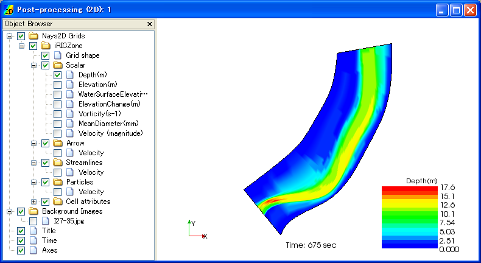
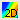

可視化ウィンドウ (2D)
======================

可視化ウィンドウ (2D) の表示例を :numref:`image_2d_post_window` に示します。

.. _image_2d_post_window:

   可視化ウィンドウ (2D)

可視化ウィンドウ (2D)
では、二次元の計算結果について可視化を行うことができます。

新しい可視化ウィンドウ (2D) を開くには、以下のいずれかの操作を行います。

**メニューバー:** 計算結果 (R) --> 新しい可視化ウィンドウ (2D)

**ツールバー**: |2d_post_window_icon|

また、既に開いた可視化ウィンドウ (2D)
を表示するには、以下の操作を行います。

**メニューバー:** 表示 (V) --> "可視化ウィンドウ (2D) : 1" など (表示したいウィンドウのタイトル)

可視化ウィンドウ (2D)に関連する操作については、
:ref:`sec_2d_vis_func` を参照してください。
