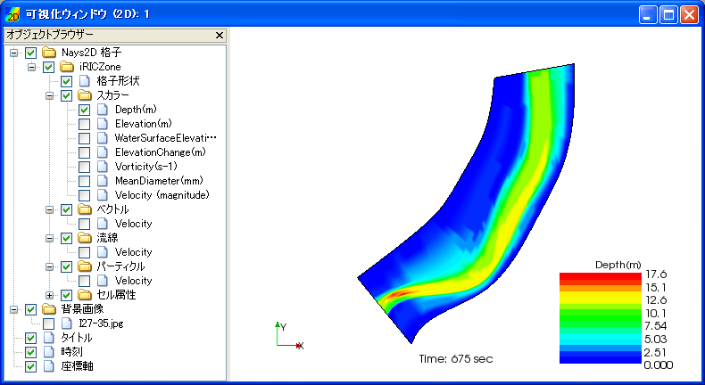

[2D Post-processing Window]
===========================================

:numref:`image_2d_post_window` shows an example of the [2D Post-processing Window].

.. _image_2d_post_window:

   [2D Post-processing Window]

The [2D Post-processing Window] visualizes the two-dimensional
simulation results.

You can open a new [2D Post-processing Window] with either of the
following actions:

**Menu bar**: [Calculation Results] (R) --> [Open New 2D Post-processing Window]

**Operation Toolbar**: |2d_post_window_icon|

You can activate a [2D Post-processing Window] that already exists, with
the following action:

**Menu bar:** [View] (V) --> The title of window you want to activate; for example "Post-processing (2D): 1"

Refer to :ref:`sec_2d_vis_func` for detail.
