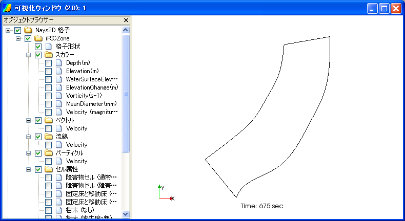
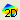

[Bird's-Eye 2D Post-processing Window]
=============================================

:numref:`image_birdseye_2d_post_window` shows an example of the [Bird's-Eye 2D Post-processing
Window].

.. _image_birdseye_2d_post_window:

   [Bird’s-Eye 2D Post-processing Window]

The [Bird’s Eye 2D Post-processing Window] visualizes the
two-dimensional simulation results in bird’s-eye view.

You can open a new [Bird's-Eye 2D Post-processing Window] with either of
the following actions:

**Menu bar:** [Calculation Results] (R) --> [Open New Bird's-Eye 2D Post-processing Window]

**Operation Toolbar**: |birdseye_2d_post_window_icon|

You can activate a [Bird's-Eye 2D Post-processing Window] that already
exists, with the following action:

**Menu bar:** [View] (V) --> The title of window you want to activate; for example "Bird’s-Eye Post-processing (2D): 1"

Refer to :ref:`sec_2dbirdeye_vis_func` for detail.
