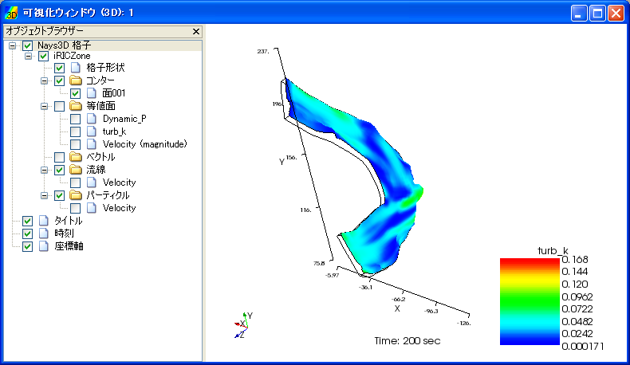

.. _sec_vis3d_window_abst:

[3D Post-processing Window]
=================================

:numref:`image_3d_post_window` shows an example of the [3D Post-processing Window].

.. _image_3d_post_window:

   [3D Post-processing Window]

The [3D Post-processing Window] visualizes the three-dimensional
simulation results.

You can open a new [3D Post-processing Window] with either of the
following actions:

**Menu bar:** [Calculation Results] (R) --> [Open New 3D Post-processing Window]

**Operation Toolbar**: |3d_post_window_icon|

You can activate a [3D Post-processing Window] that already exists, with
the following action:

**Menu bar:** [View] (V) --> The title of window you want to activate; for example "Post-processing (3D): 1"

Refer to :ref:`sec_3d_vis_func` for detail.
