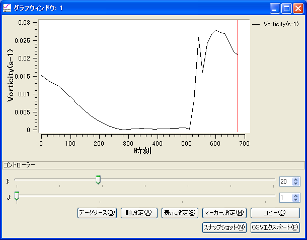

[Graph Window]
===================

:numref:`image_graph_window` shows an example of the [Graph Window].

.. _image_graph_window:

   [Graph Window]

The [Graph Window] makes a graph of simulation results whose X-axis is
eigher of position (I, J or K) or time. You can change the target data
to make graph easily using the slide bars shown below the graph.

You can open a new [Graph Window] with either of the following actions:

.. |graph_window_icon| image:: images/graph_window_icon.png

**Menu bar:** [Calculation Results] (R) --> [Open New Graph Window]

**Operation Toolbar**: |graph_window_icon|

You can activate a [Graph Window] that already exists, with the
following action:

**Menu bar:** [View] (V) --> The title of window you want to activate; for example "Graph Window: 1"

Refer to :ref:`sec_graph_window` for detail.
