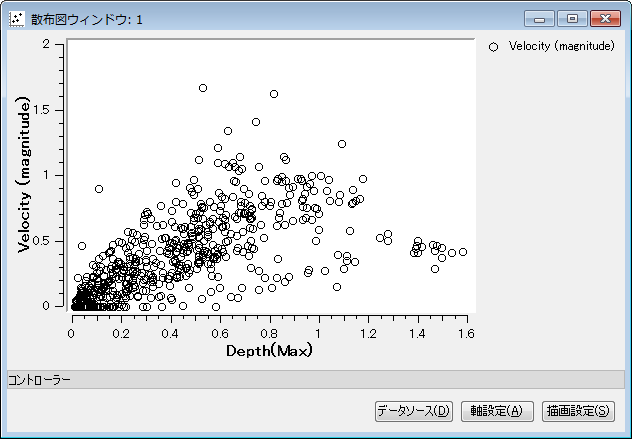
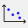

.. _sec_scattered_graph_window:

散布図ウィンドウ
=================

散布図ウィンドウの表示例を :numref:`image_scattered_chart_window` に示します。

.. _image_scattered_chart_window:

   散布図ウィンドウ表示例

散布図ウィンドウでは、シミュレーション結果について、X軸を計算結果
もしくは X座標, Y座標とする散布図を描画することができます。

新しい散布図ウィンドウを開くには、以下のいずれかの操作を行います。

**メニューバー:** 計算結果 (R) --> 新しい散布図ウィンドウを開く

**ツールバー**: |scatter_chart_window_icon|

また、既に開いた散布図ウィンドウを表示するには、以下の操作を行います。

**メニューバー:** 表示 (V) --> "散布図ウィンドウ: 1" など (表示したいウィンドウのタイトル)

散布図ウィンドウに関連する操作については、:ref:`sec_scattered_chart_window_detail` を参照してください。
