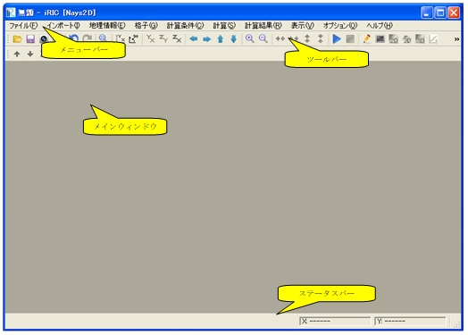

.. _sec_windows:

画面構成
=========

iRICの画面構成を :numref:`image_iric_main_window` に示します。

メニューバーとツールバーを利用する、標準的なインターフェースを採用しています。
メニューバー、ツールバー、ステータスバーについては
:ref:`sec_menubar_and_toolbar_and_status_bar` で説明します。

iRIC では、利用したい機能によって、メインウィンドウに様々なサブウィンドウを
表示して利用します。

サブウィンドウについて、:ref:`sec_pre_window` ～
:ref:`sec_scattered_graph_window` で説明します。

プロジェクトの開始直後は、プリプロセッサーが開きます。
それ以外のサブウィンドウは、必要に応じてユーザが新しく開いて利用します。

.. _image_iric_main_window:

   iRIC 画面構成

.. toctree::
   :maxdepth: 3

   02_01_menubar_toolbar
   02_02_pre_window
   02_03_solverconsole
   02_04_2d_post_window
   02_05_birdseye_2d_post_window
   02_06_3d_post_window
   02_07_graph_window
   02_08_scattered_chart_window
