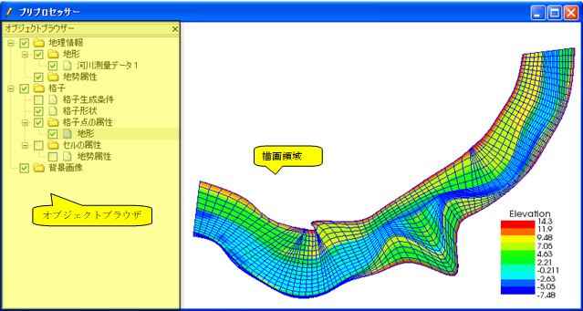

Basic operations
=================

The basic operations of iRIC are explained below.

.. _sec_iric_start_page:

[iRIC Start Page]
-------------------

When iRIC is launched, the [iRIC Start Page] opens. :numref:`image_start_page_ssp`
shows the [iRIC Start Page].

On the [iRIC Start Page], the [Start Simulation Project] tab is active
at first. The following are the items on the [Start Simulation Project]
tab.

[New Project] (N)
~~~~~~~~~~~~~~~~~~~~~

Starts a new project. Refer to :ref:`sec_new_project`.

[Recent Solvers]
~~~~~~~~~~~~~~~~~

To start a new project for a certain solver, click on the name of
the solver you want to use.

[Open a project file]
~~~~~~~~~~~~~~~~~~~~~~~

Open a project file. Refer to :ref:`sec_open_project`.

[Recent projects]
~~~~~~~~~~~~~~~~~~~~
To open a project, click on the name of the project.

.. _image_start_page_ssp:

.. figure:: images/start_page_ssp.png

   [iRIC Start Page] ([Start Simulation Project] tab)

To open the [Support] tab, click on [Support].
:numref:`image_start_page_support` shows an
example. The [Support] tab provides links to iRIC web pages. To access
the web pages, click on the link to open the web browser.

.. _image_start_page_support:

   [iRIC Start Page] ([Support] tab)

Operations in [Object Browser]
---------------------------------

iRIC uses [Object Browser] for all subwindows except [Solver Console]
and [Graph Window]. :numref:`image_object_browser_pre_window` shows example
of the [Object Browser] of the [Pre-processing Window].

.. _image_object_browser_pre_window:

   [Object Browser] of the [Pre-processing Window]

In [Object Browser], the following operations can be made:

Selecting an operation target
~~~~~~~~~~~~~~~~~~~~~~~~~~~~~~~~

Left click on the item to select data to be edited. The menu enables
operations that are possible under the configuration of items selected
in [Object Browser].

Switching between "show" and "hide"
~~~~~~~~~~~~~~~~~~~~~~~~~~~~~~~~~~~~

Make a check mark in the box left of the item, to make it shown on the
canvas. For items in hierarchical trees, if the check mark for the
upper-level item is removed, the item and all the lower-level items are
hidden.

Changing the order of items
~~~~~~~~~~~~~~~~~~~~~~~~~~~~~

.. |icon_move_up|   image:: images/icon_move_up.png

An item can be moved up and down to change order. This operation is
available only for [Geographic Data] and [Background Images] on
[Pre-processing Window]. Select |icon_move_up| / |icon_move_down| on
the Operation Toolbar to change order of items.

Changing a display setting in [Property] dialog.
~~~~~~~~~~~~~~~~~~~~~~~~~~~~~~~~~~~~~~~~~~~~~~~~~~~

Open right-clicking menu and click on [Property] to open a dialog and
modify settings. Some items do not have [Property] dialog.

Importing / exporting data
~~~~~~~~~~~~~~~~~~~~~~~~~~~~~

Open right-clicking menu on an item to facilitate data import or export.
Some items do not have import / export feature.

View changing operations on the canvas
-----------------------------------------

View changing operations can be made with Ctrl key and mouse operations.
See :numref:`table_view_change_ops_canvas` for details.

.. |cursor_operation_rotate| image:: images/cursor_operation_rotate.png
.. |cursor_operation_zoom|   image:: images/cursor_operation_zoom.png
.. |cursor_operation_pan|    image:: images/cursor_operation_pan.png

.. list-table:: View changing operations on the canvas
   :name: table_view_change_ops_canvas
   :header-rows: 1

   * - Operation
     - Action
     - Cursor

   * - Pan
     - Ctrl + Left dragging
     - |cursor_operation_pan|

   * - Zoom in / out
     - Ctrl + Dragging the scroll wheel
     - |cursor_operation_zoom|

   * - Rotate
     - Ctrl + Right dragging
     - |cursor_operation_rotate|

You can open a [Mouse Hint] dialog with either of the following actions:

.. |icon_mouse_hints| image:: images/icon_mouse_hints.png

**Menu bar:** [Help] (H) --> [Mouse Hints] (M)

**Operation Toolbar**: |icon_mouse_hints|

:numref:`image_mouse_hint_dialog` shows the [Mouse Hint] dialog.

.. _image_mouse_hint_dialog:

.. figure:: images/mouse_hint_dialog.png

   The [Mouse Hint] dialog

You can change view setting of canvas with the Main Toolbar too. (Refer
to :ref:`sec_main_toolbar`)
