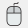

基本操作
=========

iRICの基本的な操作について説明します。

.. _sec_iric_start_page:

スタートページでの操作
------------------------

iRIC 起動直後には、iRIC スタートページが表示されます。iRIC
スタートページの表示例を :numref:`image_start_page_ssp` に示します。

スタートページでは、最初は「計算プロジェクトを始める」のタブが表示されています。
「計算プロジェクトを始める」タブの表示項目を以下に示します。

「新しいプロジェクト」ボタン
~~~~~~~~~~~~~~~~~~~~~~~~~~~~

押すと、新しいプロジェクトを開始します。:ref:`sec_new_project` を参照してください。

最近使ったソルバーのリスト
~~~~~~~~~~~~~~~~~~~~~~~~~~~~

ソルバーの名前をクリックすると、そのソルバーを使う新しいプロジェクトを開始します。

「プロジェクトファイルを開く」ボタン
~~~~~~~~~~~~~~~~~~~~~~~~~~~~~~~~~~~~~

押すと、プロジェクトファイルを開きます。:ref:`sec_open_project`
を参照してください。

最近開いたプロジェクトのリスト
~~~~~~~~~~~~~~~~~~~~~~~~~~~~~~~

プロジェクトの名前をクリックすると、そのプロジェクトファイルを開きます。

.. _image_start_page_ssp:

.. figure:: images/start_page_ssp.png

   iRIC スタートページ 表示例 (計算プロジェクトを始める)

「サポート」タブをクリックすると、「サポート」タブが表示されます。表示例を
:numref:`image_start_page_support` に示します。サポートタブには、iRIC
に関連するページへのリンクが表示されます。リンクをクリックすると、 Web
ブラウザが開いてクリックしたページが表示されます。

.. _image_start_page_support:

.. figure:: images/start_page_support.png

   iRIC スタートページ 表示例 (サポート)

オブジェクトブラウザーでの操作
-------------------------------

iRIC では、ソルバーコンソールを除くすべてのサブウィンドウで、
オブジェクトブラウザーを利用します。プリプロセッサーでのオブジェクトブラウザー
の表示例を :numref:`image_object_browser_pre_window` に示します。

.. _image_object_browser_pre_window:

.. figure:: images/object_browser_pre_window.png

   プリプロセッサーでのオブジェクトブラウザー表示例

オブジェクトブラウザーで行える操作は以下の通りです。

編集対象の選択
~~~~~~~~~~~~~~~~

左クリックで項目を選択することで、編集する対象データを選択します。
選択状態が変わると、メニューでは現在の選択状態で可能な操作のみ、有効になります。

項目の表示・非表示切り替え
~~~~~~~~~~~~~~~~~~~~~~~~~~~

項目の左にあるチェックボックスにより、描画領域での表示・非表示を切り替えます。
複数の階層構造のある項目では、親の項目のチェックが外されると、
子の項目が非表示になります。

上下移動
~~~~~~~~~

.. |icon_move_up|   image:: images/icon_move_up.png
.. |icon_move_down| image:: images/icon_move_down.png

項目の上下関係を変更することができます。この操作は、プリプロセッサ上の地理情報と
背景画像についてのみ有効です。上下関係の変更は、操作ツールバーの
|icon_move_up|, |icon_move_down| のボタンで行います。

表示プロパティの変更
~~~~~~~~~~~~~~~~~~~~~~

右クリックメニューで表示される「プロパティ」メニューから、
項目の表示プロパティを変更します。
「プロパティ」メニューが表示されない項目もあります。

データのインポート、エクスポート
~~~~~~~~~~~~~~~~~~~~~~~~~~~~~~~~~

右クリックメニューから、データのインポート、エクスポートを行えます。
インポート、エクスポートが行えない項目もあります。

描画領域での表示操作
-----------------------

描画領域の表示をCtrlキーとマウスとの組み合わせで操作できます。表示操作方法について、
:numref:`table_view_change_ops_canvas` に示します。

.. list-table:: 描画画面での表示操作
   :name: table_view_change_ops_canvas
   :header-rows: 1

   * - 表示操作
     - 操作内容
     - 操作中のカーソル

   * - 移動
     - Ctrl キーを押したまま、左ドラッグ
     - |cursor_operation_pan|

   * - 拡大・縮小
     - Ctrl キーを押したまま、中央ボタン(ホイール)ドラッグ、またはホイールの前後回転
     - |cursor_operation_zoom|

   * - 回転
     - Ctrl キーを押したまま、右ドラッグ
     - |cursor_operation_rotate|

マウス操作のヘルプを表示するには、以下のいずれかの操作を行います。

**メニューバー:** ヘルプ (H) --> マウスヒント (M)

**ツールバー**: |icon_mouse_hints|

表示されるマウスヒントのダイアログを :numref:`image_mouse_hint_dialog` に示します。

.. _image_mouse_hint_dialog:

.. figure:: images/mouse_hint_dialog.png

   マウスヒントダイアログ

なお、描画領域での表示操作は、メインツールバーのボタンからも行えます
(:ref:`sec_main_toolbar` 参照)。
