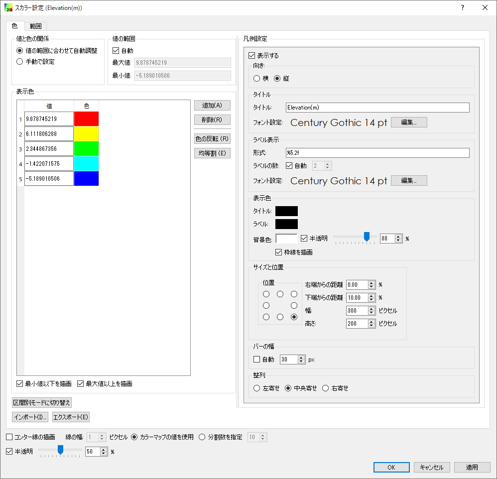

.. _sec_colormap:

カラーマップ機能
=======================

概要
------------

iRIC では、値に基づいて色を変えて表示する機能が、様々な機能で使われています。
この機能をカラーマップ機能と呼びます。

この節では、カラーマップ機能の利用法について説明します。

基本的な使い方
------------------

.. _sec_colormap_basic_real:

実数値の場合
~~~~~~~~~~~~~~~~~~~

:numref:`image_color_setting_dialog_real` に示すダイアログが表示されます。

.. _image_color_setting_dialog_real:

   カラーマップ設定ダイアログ (実数値)

設定項目について以下で説明します。

プリセット
   あらかじめ定義されたカラーマップ設定をコンボボックスから読み込みます。

   以下のフォルダに保存された設定ファイルから拡張子 (.cmsetting) を除いた文字列のリストが候補として表示されます。コンボボックスで項目を選択すると、選択したファイルから設定がインポートされます。

   * colormaps (iRICのインストーラに同梱された設定)
   * private/colormaps (ユーザが保存した設定)

値と色の関係
   以下のいずれかから選択します。

   * **値の範囲に合わせて自動調整**: 「値の範囲」の「最大値」と「最小値」を指定すると、その下の「表示色」において「色」に対応する「値」が自動で調整されます。
   * **手動で設定**: 「値の範囲」の設定項目がなくなり、「表示色」で色に対応する値を手動で設定します。

値の範囲
   表示色における値の最小値、最大値を設定します。「値と色の関係」として「値の範囲に合わせて自動調整」を選択している時のみ表示されます。

   「自動」をチェックすると、最小値、最大値は、データの値の範囲に自動で設定されます。

表示色
   値と色の対応関係を指定します。

最小値以下を描画
   チェックを外すと、表示色における最小値以下の領域は描画されなくなります。

最大値以上を描画
   チェックを外すと、表示色における最大値以上の領域は描画されなくなります。

区間別モードに切り替え
   表示色設定を「区間別モード」に切り替えます。

   ボタンを押すと、 :numref:`color_setting_switch_to_discrete_dialog` に示す
   ダイアログが表示されます。最小値、最大値、色の数を指定すると、
   :numref:`image_color_setting_dialog_real_discrete` に示すようにダイアログが
   変化し、値の区間ごとに色を指定するモードになります。区間別モードになるとこのボタンは
   「グラデーションモードに切り替え」に変化します。

   グラデーションモードと区間別モードそれぞれでの値の表示例を
   :numref:`image_color_example_gradation` と
   :numref:`image_color_example_discrete` に示します。

.. _color_setting_switch_to_discrete_dialog:

.. figure:: images/color_setting_switch_to_discrete_dialog.png
   :width: 240pt

   区間別モードへの切り替えダイアログ

.. _image_color_setting_dialog_real_discrete:

.. figure:: images/color_setting_dialog_real_discrete.png
   :width: 440pt

   表示色設定ダイアログ (実数値) (区間別モード)

.. _image_color_example_gradation:

.. figure:: images/color_example_gradation.png
   :width: 480pt

   実数値の表示例 (グラデーションモード)

.. _image_color_example_discrete:

   実数値の表示例 (区間別モード)

インポート・エクスポート
   設定内容をファイルからインポートしたりエクスポートしたりします。

   エクスポートする際は、 iRIC がインストールされたフォルダの下の private/colormaps フォルダに保存することを推奨します。ここに保存すると、「プリセット」から簡単に呼び出せるようになります。

凡例設定
   凡例の表示に関する設定を行います。

   表示
      以下のいずれかを指定します。

      * **選択されている時のみ**: オブジェクトブラウザで該当する項目が選択されている時のみ、凡例を表示します。
      * **常に**: 常に凡例を表示します。
      * **表示しない**: 常に凡例を非表示にします。
   
   向き
      凡例の向きを横・縦から指定します。横向き、縦向きの凡例の例をそれぞれ :numref:`color_setting_legend_horizontal` 、 :numref:`color_setting_legend_vertical` に示します。
   
   タイトル
      タイトルとそのフォント設定を指定します。
   
   ラベル表示
      ラベルの数字の形式、ラベルの数、ラベルのフォント設定を指定します。
      
      ラベルの数は、グラデーションモードの場合は「自動」チェックボックスを外して任意の数を指定できます。区間別モードに切り替えると、ラベルの数は常に自動設定となります。

   表示色
      タイトル、ラベル、背景の色を指定します。
   
   サイズと位置
      凡例を指定するサイズと位置を指定します。「位置」のラジオボタンにより、凡例の表示位置を、左上、上、右上など8つのいずれかから指定できます。

.. _color_setting_legend_horizontal:

   凡例 表示例 (横)

.. _color_setting_legend_vertical:

   凡例 表示例 (縦)

.. _sec_colormap_basic_int:

整数値の場合
~~~~~~~~~~~~~~~~

:numref:`image_color_setting_dialog_int` に示すダイアログが表示されます。

.. _image_color_setting_dialog_int:

.. figure:: images/color_setting_dialog_int.png
   :width: 440pt

   表示色設定ダイアログ (整数)

設定項目について以下で説明します。

表示色
   値と色の対応関係を指定します。
   
   「透明」をチェックすると、ポリゴンなどは枠線のみが表示され、塗りつぶし領域は透明になります。

インポート・エクスポート
   設定内容をファイルからインポートしたりエクスポートしたりします。

凡例設定
   凡例の表示に関する設定を行います。

   表示
      以下のいずれかを指定します。

      * **選択されている時のみ**: オブジェクトブラウザで該当する項目が選択されている時のみ、凡例を表示します。
      * **常に**: 常に凡例を表示します。
      * **表示しない**: 常に凡例を非表示にします。
      
   タイトル
      タイトルとそのフォント設定を指定します。
   
   ラベル表示
      ラベルのフォント設定を指定します。

   表示色
      タイトル、ラベル、背景の色を指定します。
   
   サイズと位置
      凡例を指定するサイズと位置を指定します。「位置」のラジオボタンにより、凡例の表示位置を、左上、上、右上など8つのいずれかから指定できます。
