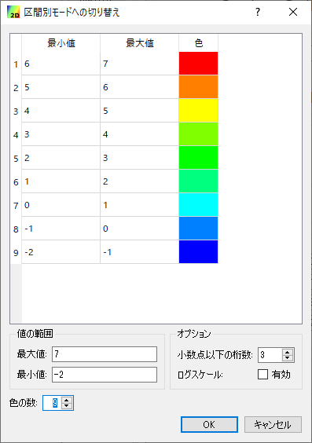

.. _sec_colormap:

カラーマップ機能
=======================

.. contents:: 
   :depth: 3
   :local:

概要
------------

iRIC では、値に基づいて色を変えて表示する機能が、様々な機能で使われています。
この機能をカラーマップ機能と呼びます。

この節では、カラーマップ機能の利用法について説明します。

基本的な使い方
------------------

カラーマップを表示する値が実数の場合と整数の場合に分けて説明します。

.. _sec_colormap_basic_real:

実数値の場合
~~~~~~~~~~~~~~~~~~~

:numref:`image_color_setting_dialog_real` に示すダイアログが表示されます。

.. _image_color_setting_dialog_real:

.. figure:: images/color_setting_dialog_real.png
   :width: 440pt

   カラーマップ設定ダイアログ (実数値)

設定項目について以下で説明します。

値と色の関係
^^^^^^^^^^^^^^^^^^^^^^^^^
   以下のいずれかから選択します。

   * **値の範囲に合わせて自動調整**: 「値の範囲」の「最大値」と「最小値」を指定すると、その下の「表示色」において「色」に対応する「値」が自動で調整されます。
   * **手動で設定**: 「値の範囲」の設定項目がなくなり、「表示色」で色に対応する値を手動で設定します。

値の範囲
^^^^^^^^^^^^^^^^^^^^^^^^^
   表示色における値の最小値、最大値を設定します。「値と色の関係」として「値の範囲に合わせて自動調整」を選択している時のみ表示されます。
   「自動」をチェックすると、最小値、最大値は、タイムステップ毎のデータの値の範囲に自動で設定されます。

表示色
^^^^^^^^^^^^^^^^^^^^^^^^^
   値と色の対応関係を指定します。

追加
+++++++++++++++++++++++++
   値と色の対応関係を追加します。

削除
+++++++++++++++++++++++++
   選択している値と色の対応関係を削除します。(複数選択可)

色の反転
+++++++++++++++++++++++++
   値と色の関係の色の順序が反転します。

均等割
+++++++++++++++++++++++++
   値の最大値と最小値を、値と色の関係の数で等分する値を与えます。

   .. figure:: images/equal_division.png
      :width: 300pt

      均等割

最小値以下を描画
+++++++++++++++++++++++++
   チェックを外すと、表示色における最小値以下の領域は描画されなくなります。

最大値以上を描画
+++++++++++++++++++++++++
   チェックを外すと、表示色における最大値以上の領域は描画されなくなります。

区間別モードに切り替え
^^^^^^^^^^^^^^^^^^^^^^^^^
   表示色設定を「区間別モード」に切り替えます。

   ボタンを押すと、 :numref:`color_setting_switch_to_discrete_dialog` に示す
   ダイアログが表示されます。最小値、最大値、小数点以下の桁数、色の数を指定すると、
   :numref:`image_color_setting_dialog_real_discrete` に示すようにダイアログが
   変化し、値の区間ごとに色を指定するモードになります。区間別モードになるとこのボタンは
   「グラデーションモードに切り替え」に変化します。
   :numref:`color_setting_switch_to_discrete_dialog` に示すダイアログで「ログスケール」のチェックボックスにチェックを入れると最小値から最大値の範囲をログスケールで色分け出来ます。

   グラデーションモードと区間別モードそれぞれでの値の表示例を
   :numref:`image_color_example_gradation` と
   :numref:`image_color_example_discrete` に示します。

.. _color_setting_switch_to_discrete_dialog:

   区間別モードへの切り替えダイアログ

.. _image_color_setting_dialog_real_discrete:

   表示色設定ダイアログ (実数値) (区間別モード)

.. _image_color_example_gradation:

.. figure:: images/color_example_gradation.png
   :width: 480pt

   実数値の表示例 (グラデーションモード)

.. _image_color_example_discrete:

.. figure:: images/color_example_discrete.png
   :width: 480pt

   実数値の表示例 (区間別モード)

インポート・エクスポート
^^^^^^^^^^^^^^^^^^^^^^^^^
   設定内容をファイルからインポートしたりエクスポートしたりします。

凡例設定
^^^^^^^^^^^^^^^^^^^^^^^^^
   凡例の表示に関する設定を行います。

   表示
      チェックを入れると凡例を表示します。
   
   向き
      凡例の向きを横・縦から指定します。横向き、縦向きの凡例の例をそれぞれ :numref:`color_setting_legend_horizontal` 、 :numref:`color_setting_legend_vertical` に示します。
   
   タイトル
      タイトルとそのフォント設定を指定します。
   
   ラベル表示
      ラベルの数字の形式、ラベルの数、ラベルのフォント設定を指定します。
      
      ラベルの数は、グラデーションモードの場合は「自動」チェックボックスを外して任意の数を指定できます。区間別モードに切り替えると、ラベルの数は常に自動設定となります。

   表示色
      タイトル、ラベル、背景の色を指定します。
   
   サイズと位置
      凡例を指定するサイズと位置を指定します。「位置」のラジオボタンにより、凡例の表示位置を、左上、上、右上など8つのいずれかから指定できます。
   
   バーの幅
      カラーバーの幅を指定できます。「自動」にチェックをいれると、凡例の幅に対して自動で設定されます。
   
   整列
      タイトル、カラーバーの整列方法を選択できます。

コンター線の描写
^^^^^^^^^^^^^^^^^^^^^^^^^
   コンター線の描写のチェックボックスにチェックを入れると等高線表示になります。

   線の幅
      コンター線の太さをピクセル単位で指定できます。
   
   コンター線を表示する値と分割数
      コンター線の値と分割数は以下の2パターンから選択できます。線の色はどちらも「表示色」で設定した色が使用されます。

      * **カラーマップの値を使用**: 「表示色」で設定されている値と色を使用してコンター線を表示します。
      * **分割数を指定**: 分割数を指定して「表示色」で設定されている最小値と最大値を当分割した値でコンター線を表示します。

半透明
^^^^^^^^^^^^^^^^^^^^^^^^^
   チェックボックスにチェックを入れるとスライダーで指定した透過度でカラーマップを表示します。

設定の保存・キャンセル・適用
^^^^^^^^^^^^^^^^^^^^^^^^^^^^^^^^
   * **保存**: 設定内容を保存・適用して設定画面を閉じます。
   * **キャンセル**: 変更したスカラー設定を破棄して設定画面を閉じます。「適用」で反映していた内容も破棄されます。
   * **適用**: 設定内容の保存をせず、設定画面を開いたまま設定内容を適用します。

.. _color_setting_legend_horizontal:

.. figure:: images/color_setting_legend_horizontal.png
   :width: 250pt

   凡例 表示例 (横)

.. _color_setting_legend_vertical:

.. figure:: images/color_setting_legend_vertical.png
   :width: 110pt

   凡例 表示例 (縦)

.. _sec_colormap_basic_int:

整数値の場合
~~~~~~~~~~~~~~~~

:numref:`image_color_setting_dialog_int` に示すダイアログが表示されます。

.. _image_color_setting_dialog_int:

   表示色設定ダイアログ (整数)

設定項目について以下で説明します。

表示色
^^^^^^^^^^^^^^^^^^^^^^^^^
   値と色の対応関係を指定します。
   
   「透明」をチェックすると、ポリゴンなどは枠線のみが表示され、塗りつぶし領域は透明になります。

インポート・エクスポート
^^^^^^^^^^^^^^^^^^^^^^^^^
   設定内容をファイルからインポートしたりエクスポートしたりします。

凡例設定
^^^^^^^^^^^^^^^^^^^^^^^^^
   凡例の表示に関する設定を行います。

   表示
      以下のいずれかを指定します。

      * **選択されている時のみ**: オブジェクトブラウザで該当する項目が選択されている時のみ、凡例を表示します。
      * **常に**: 常に凡例を表示します。
      * **表示しない**: 常に凡例を非表示にします。
      
   タイトル
      タイトルとそのフォント設定を指定します。
   
   ラベル表示
      ラベルのフォント設定を指定します。

   表示色
      タイトル、ラベル、背景の色を指定します。
   
   サイズと位置
      凡例を指定するサイズと位置を指定します。「位置」のラジオボタンにより、凡例の表示位置を、左上、上、右上など8つのいずれかから指定できます。
   
   バーの幅
      カラーバーの幅を指定できます。「自動」にチェックをいれると、凡例の幅に対して自動で設定されます。
   
   整列
      タイトル、カラーバーの整列方法を選択できます。

コンター線の描写
^^^^^^^^^^^^^^^^^^^^^^^^^
   コンター線の描写のチェックボックスにチェックを入れると等高線表示になります。

   線の幅
      コンター線の太さをピクセル単位で指定できます。
   
   コンター線を表示する値と分割数
      コンター線の値と分割数は以下の2パターンから選択できます。線の色はどちらも「表示色」で設定した色が使用されます。

      * **カラーマップの値を使用**: 「表示色」で設定されている値と色を使用してコンター線を表示します。
      * **分割数を指定**: 分割数を指定して「表示色」で設定されている最小値と最大値を当分割した値でコンター線を表示します。

半透明
^^^^^^^^^^^^^^^^^^^^^^^^^
   チェックボックスにチェックを入れるとスライダーで指定した透過度でカラーマップを表示します。

設定の保存・キャンセル・適用
^^^^^^^^^^^^^^^^^^^^^^^^^^^^^^^^
   * **保存**: 設定内容を保存・適用して設定画面を閉じます。
   * **キャンセル**: 変更したスカラー設定を破棄して設定画面を閉じます。「適用」で反映していた内容も破棄されます。
   * **適用**: 設定内容の保存をせず、設定画面を開いたまま設定内容を適用します。

インポート・エクスポート
---------------------------------
カラーマップの設定内容をファイルからインポート・エクスポートできます。

インポート
~~~~~~~~~~~~~~~~~~~

インポートの方法はモードから選択できます。

   * **標準設定から選択**: 標準設定に追加されている設定項目から選択します。
   * **ファイルを選択**: 任意の場所に保存された設定ファイルを指定して設定を読み込みます。

標準設定から選択
^^^^^^^^^^^^^^^^^^^^^^^^^
標準選択モードのダイアログを :numref:`image_color_import_dialog_standard` に示す。

.. _image_color_import_dialog_standard:

   インポートダイアログ(標準設定から選択)

設定項目を以下で説明します。

   標準設定
      標準設定として追加されている設定ファイルを選択できます。設定ファイルの選択、フォルダの展開等はキーボードの矢印キーでも行なえます。

      パブリック
         iRIC がインストールされたフォルダの下のcolormapsフォルダの中の設定ファイルがサブフォルダの構造ごと表示されます。
         これらの設定ファイルはiRICインストール時にデフォルトでインストールされます。
      
      プライベート
         iRIC がインストールされたフォルダの下のprivate/colormpasフォルダの中の設定ファイルがサブフォルダの構造ごと表示されます。
         これらの設定ファイルはユーザーが任意に追加するものです。

         追加の設定ファイルを `こちら <https://i-ric.org/download/colormapsettingfiles/>`_ からダウンロードできます。

         .. note::
            private/colormpasがない場合は作成してください。

   インポートする属性
      設定ファイルからインポートする属性を選択できます。インポートしたい属性のチェックボックスにチェックを入れて下さい。

   プレビュー
      標準設定で選択した設定ファイルをインポートする際のプレビューが表示されます。

ファイルを選択
^^^^^^^^^^^^^^^^^^^^^^^^^
ファイルを選択モードのダイアログを :numref:`image_color_import_dialog_standard` に示す。

.. _image_color_import_dialog_select_file:

   インポートダイアログ(ファイルを選択)

設定項目を以下で説明します。

   ファイル
      「...」ボタンを押すと現れるファイル選択ダイアログから任意の場所に保存した設定ファイル( `*.cmsetting` )を指定できます。

   インポートする属性
      設定ファイルからインポートする属性を選択できます。インポートしたい属性のチェックボックスにチェックを入れて下さい。

   プレビュー
      指定した設定ファイルをインポートする際のプレビューが表示されます。

エクスポート
~~~~~~~~~~~~~~~~~~~
現在の設定を設定ファイル( `*.cmsetting` )として出力できます。
iRIC がインストールされたフォルダの下のprivate/colormapsフォルダ以下に保存しておくことで、インポート時に標準設定の一覧に追加されます。
