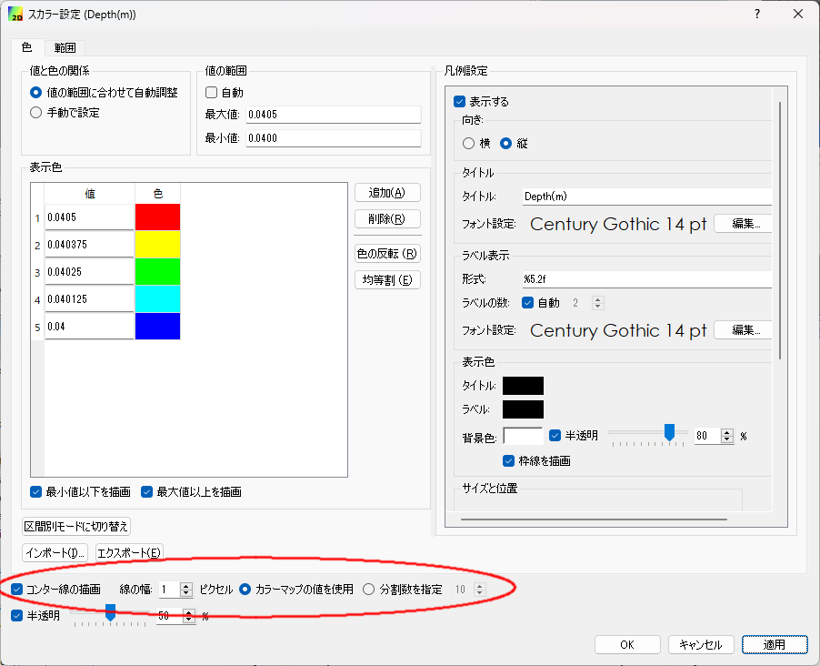

.. _sec_contour:

コンター表示機能
=======================

概要
------------

iRIC では、スカラー量の表示において、面を塗って表示する機能の他にコンター線を
描画する機能があります。この機能をコンター表示機能と呼びます。

例を :numref:`image_scalar_and_contour` に示します。下がコンター線を描画した例です。

この節では、コンター表示機能の利用法について説明します。

.. _image_scalar_and_contour:

.. figure:: images/scalar_and_contour.png
   :width: 440pt

   スカラー量の面塗りとコンター表示の例

基本的な使い方
------------------

.. _sec_contour_basic:

コンター表示ができる機能の設定ダイアログの例を :numref:`image_contour_widget` に示
します。赤い円で囲った部分が、コンター表示機能に関係する部分です。

コンター表示機能のインターフェースは、カラーマップ設定機能のインターフェースとともに表示されます。

.. _image_contour_widget:

   コンター設定機能があるダイアログ例

設定項目について以下で説明します。

コンター線の描画
   チェックを外すと面を塗る方法、チェックを付けるとコンター線を描画する方法になります。

線の幅
   コンター線の幅を指定します。

カラーマップの値を使用
   チェックすると、上のカラーマップ設定機能の「表示色」の値のコンター線が描画されます。
   :numref:`image_contour_widget` の例なら、値が 0.04, 0.040125, 0.04025, 0.040375, 0.0405 の
   コンター線が描画されます。

分割数を指定
   チェックすると、上のカラーマップ設定機能の「表示色」の最小値、最大値と、その間を指定した分割数で等分割した
   値のコンター線が描画されます。:numref:`image_contour_widget` の例なら、値が 0.04, 0.04005, 0.0401, ... 0.0405
   のコンター線が描画されます。

