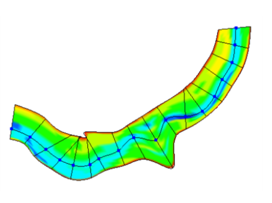
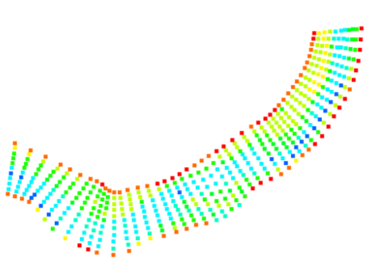
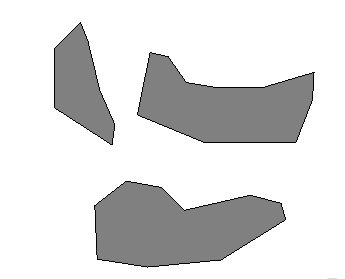
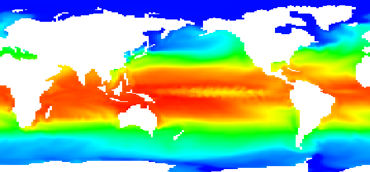

iRIC functions
=================

iRIC functions can be categorized into the seven groups below:

-  Editing geographic data
-  Creating grids
-  Editing grids
-  Loading measured data
-  Setting calculation conditions
-  Lunching a solver
-  Visualizing the calculation results
-  Making a graph

The abstract of each function groups are explained in the following
sections.

.. _sec_abst_edit_geo_data:

Editing geographic data
------------------------

Geographic data handles coordinates of data and the attributes at that
coordinates, such as elevation, vegetation type, vegetation density,
land use. You can import and edit geographic data with iRIC.

Geographic data are used to determine the attributes at each node or
cell by interpolation. You can use river survey data also for creating a
grid.

The attributes that you need to input differ by the solver you use.

iRIC can import and edit four types of geographic data:

-  River Survey Data
-  Pointset Data
-  Polygon
-  Raster data

:numref:`image_geodata_riversurvey`, :numref:`image_geodata_pointset`,
:numref:`image_geodata_polygon` and :numref:`image_geodata_raster`
show example of
[River Survey Data], [Pointset Data], [Polygon], [Raster Data] respectively.

.. _image_geodata_riversurvey:

   Example of [River Survey Data]

.. _image_geodata_pointset:

   Example of [Pointset Data]

.. _image_geodata_polygon:

   Example of [Polygon]

.. _image_geodata_raster:

   Example of [Raster Data]

Refer to :ref:`sec_pre_geodata` for detail.

.. _sec_abst_create_grid:

Creating a grid
-----------------

You can create the grid that the solver uses. A grid can be created in
two steps:

1. Determine the grid shape (coordinates of each node).
2. Determine the node/cell attributes by interpolating geographic data.

In step 1., you select one of the algorithms that can produce the grid
that the solver requires, and then, you create a grid by specifying grid
creating condition.

Step 2. is automatically done. iRIC does this step automatically by
recognizing the type of geographic data, and selecting
the appropriate algorithm for interpolation for that type.

iRIC can create grids of the following types:

-  Two-dimensional structured grid
-  Two-dimensional unstructured grid
-  One-dimensional structured grid (Each node holds sectional data.)

Refer to :ref:`sec_pre_grid_creating_func` for details.

Editing the grid
-------------------
You can edit the grid. You can do the following operations:

-  Editing the grid shape (the coordinates of each node)
-  Editing the attributes of each node or cell

Refer to :ref:`sec_pre_editing_grid` for the details.

.. _sec_abst_load_measured_data:

Loading measured data
--------------------------

You can load measured data from text files, to use it as background data
for creating data, or to compare with calculation results. You can do
the following operations:

-  Importing measured data from text files
-  Editing display settings of measured data

Refer to :ref:`sec_pre_measured_data` for the details.

Setting the calculation conditions
------------------------------------

You can set the calculation conditions. The calculation conditions
differ by the solver selected.

Refer to :ref:`sec_calc_cond` for the details.

Launching the solver
---------------------

You can launch the solver and monitors the simulation status using
[Solver Console]. You can stop calculations when you want to.
:numref:`image_solver_console_window_func` shows an
example of the [Solver Console] that displays solver outputs.

.. _image_solver_console_window_func:

.. figure:: images/solver_console_window.png
   :width: 180pt

   [Solver Console]

Refer to :ref:`sec_simulation` for details.

Post-processing
----------------

You can visualize the calculation results that the solver output. You
can use [2D Post-processing Window] (:numref:`image_2d_post_window_func`),
[Bird's-Eye 2D Post-processing Window] (:numref:`image_birdseye_2d_post_window_func`),
and [3D Post-processing Window] (:numref:`image_3d_post_window_func`) for that purpose.

Refer to :ref:`sec_vis_funcs` for details.

.. _image_2d_post_window_func:

.. figure:: images/2d_post_window.png
   :width: 280pt

   [2D Post-processing Window]

.. _image_birdseye_2d_post_window_func:

.. figure:: images/birdseye_2d_post_window.png
   :width: 280pt

   [Bird's-Eye 2D Post-processing Window]

.. _image_3d_post_window_func:

.. figure:: images/3d_post_window.png
   :width: 280pt

   [3D Post-processing Window]

Making a graph
----------------

You can display graphs with the calculation results that the solver
output, using [Graph Window] (:numref:`image_graph_window_func`) and
[Scattered Chart Window] (:numref:`image_scattered_chart_window_func`).

Refer to :ref:`sec_making_graph` for details.

.. _image_graph_window_func:

.. figure:: images/graph_window.png
   :width: 280pt

   [Graph Window]

.. _image_scattered_chart_window_func:

.. figure:: images/scattered_chart_window.png
   :width: 280pt

   [Scattered Chart Window]
