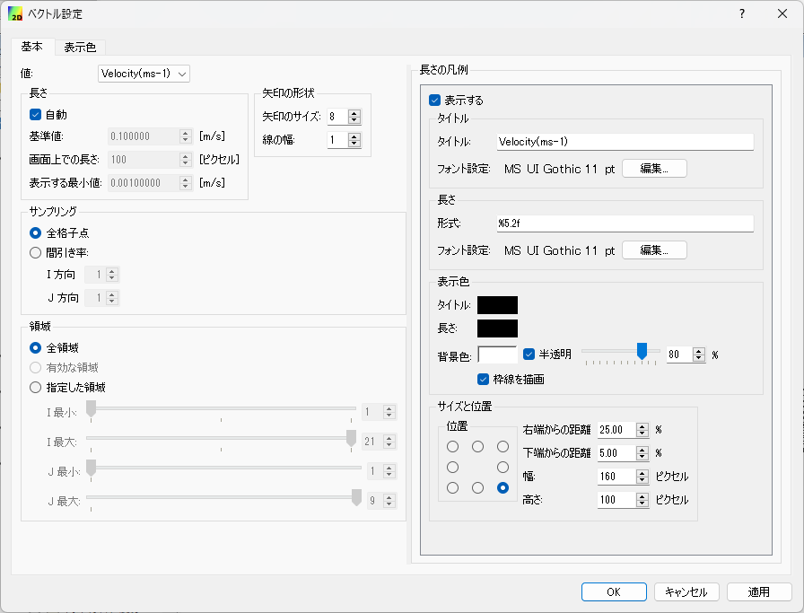
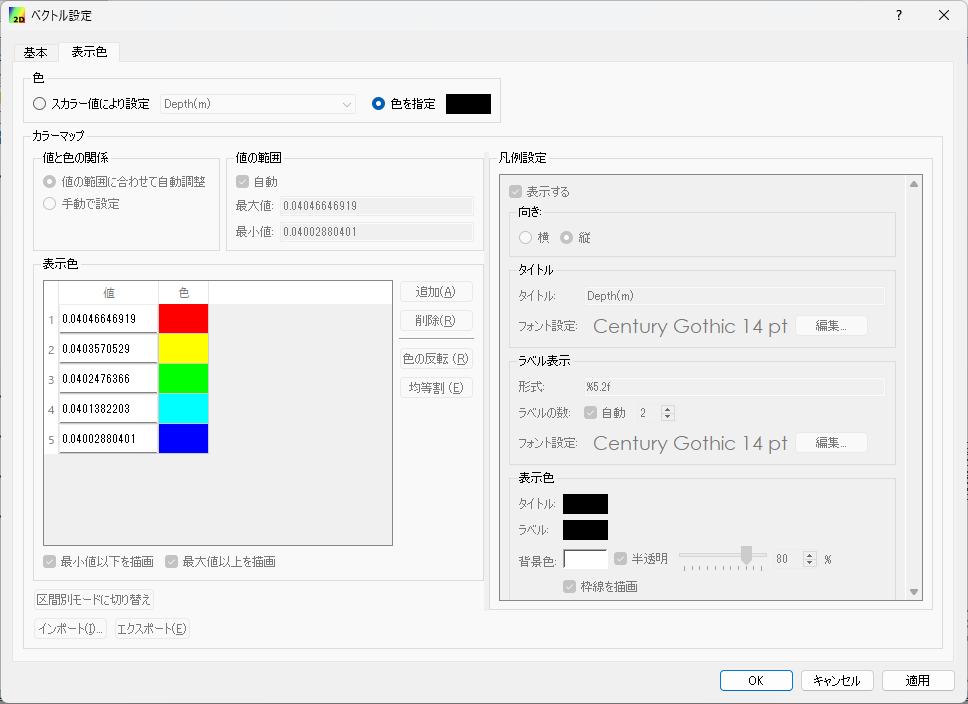

.. _sec_arrows:

ベクトル表示機能
=======================

概要
------------

iRIC では、ベクトル量に基づいて矢印を表示する機能が、様々な機能で使われています。
この機能をベクトル表示機能と呼びます。

ベクトルの表示例を :numref:`image_arrows_example` に示します。

.. _image_arrows_example:

.. figure:: images/arrows_example.png
   :width: 240pt

   ベクトル表示例

この節では、ベクトル表示機能の利用法について説明します。

基本的な使い方
------------------

ベクトル表示機能で表示されるダイアログの例を :numref:`image_arrows_dialog_basic`、
:numref:`image_arrows_dialog_color` に示します。

.. _image_arrows_dialog_basic:

   ベクトル設定ダイアログ 「基本」タブ

.. _image_arrows_dialog_color:

   ベクトル設定ダイアログ 「表示色」タブ

設定項目について以下で説明します。

「基本」タブ
~~~~~~~~~~~~~~~~~~~~

設定項目について以下で説明します。

値
   矢印を描画するのに使用するベクトル量を選択します。

長さ
   矢印の長さを決めるパラメータを指定します。
   
   「自動」をチェックすると、「基準値」「画面上での長さ」「表示する最小値」を、ベクトル量の値の分布から自動的に設定します。

   手動で設定する場合、「基準値」「画面上での長さ」「表示する最小値」はそれぞれ以下の意味を持ちます。

   基準値
      矢印の凡例を表示するのに使うベクトル量の大きさ (絶対値)
   
   画面上での長さ
      矢印の凡例の長さ (単位: ピクセル)

   表示する最小値
      絶対値がこれ以下のデータでは、矢印を描画しない

矢印の形状
   矢印の形状を決めるパラメータを指定します。

   矢印のサイズ
      矢印の先端から三角形の付け根までの長さ (単位: ピクセル)
   
   線の幅
      線の幅 (単位: ピクセル)

サンプリング
   矢印を全データに表示するのではなく、間引いて表示したい時に指定します。

   サンプリング方法の指定内容は、対象データによって異なります。

領域
   矢印を描画する領域を指定したい時に指定します。

   格子点で定義されたベクトル量を表示する時のみ表示されます。

長さの凡例
   長さの凡例の表示に関する設定を行います。

   表示する
      チェックすると凡例が表示されます。

   タイトル
      タイトルとそのフォント設定を指定します。
   
   長さ
      長さを示す数字の形式、フォント設定を指定します。

   表示色
      タイトル、長さ、背景の色を指定します。
   
   サイズと位置
      凡例を指定するサイズと位置を指定します。「位置」のラジオボタンにより、凡例の表示位置を、左上、上、右上など8つのいずれかから指定できます。

「表示色」タブ
~~~~~~~~~~~~~~~~~~~~~~

矢印の表示色に関する設定を行います。

設定項目について以下で説明します。

スカラー量により設定
   ベクトル量の定義位置でスカラー量も定義されていた場合、これをチェックすることで、スカラー量の値によって
   矢印ごとに色を変えて表示できます。

   これをチェックすると、下のカラーマップ機能が有効になります。

   カラーマップ機能の詳細は :ref:`sec_colormap` を参照してください。

色を指定
   全ての矢印を同じ色で描画する場合にチェックします。チェックすると、色選択ボックスで色を指定できます。
