.. _sec_cross-section:

断面データ表示機能
=======================

概要
------------

iRIC では、2次元構造格子を利用するソルバを使っている場合、格子線 (例: J = 1) に沿った断面
での属性を描画する機能があります。この機能を断面データ表示機能と呼びます。

.. note:: iRIC 4.0 までは入力格子の断面を表示する機能が実装されていましたが、 iRIC 4.1 以降では計算結果について断面を表示する機能が追加されました。

例を :numref:`image_crosssection_window` に示します。

この節では、断面データ表示機能の利用法について表示します。

.. _image_crosssection_window:

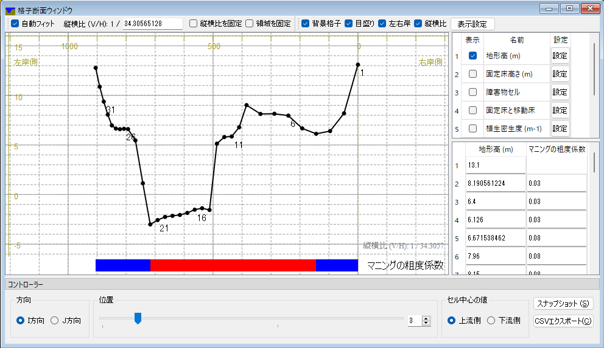

   断面データ表示ウィンドウの例

ウィンドウの領域
-------------------

断面データ表示ウィンドウの各領域について説明します。

ツールバー
~~~~~~~~~~~~~~

ツールバーはウィンドウの上端に表示されます。

ツールバーの表示例を :numref:`image_crosssection_toolbar` に示します。

.. _image_crosssection_toolbar:

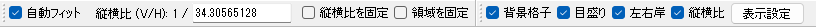

   断面データ表示ウィンドウ ツールバー

ツールバーの機能を以下に示します。

自動フィット
    チェックをつけると、コントローラで表示対象の断面を切り替えた時、全てのデータが画面に収まるよう、表示範囲が調整されます。

縦横比 (V/H)
    縦横の縮尺比を指定します。

縦横比を固定
    チェックをつけると、画面のメイン領域で Ctrl + 中ドラッグで縮尺を変更する際、縦横比を固定します。

領域を固定
    チェックをつけると、画面のメイン領域での Ctrl + 左ドラッグ、 Ctrl + 中ドラッグでの表示領域の変更機能を無効にします。

背景格子
    チェックをつけると背景格子を表示します。

目盛り
    チェックをつけると目盛りを表示します。

左右岸
    「左岸側」、「右岸側」のラベルを表示します。

縦横比
    メイン領域内に縦横比を表示します。

表示設定
    表示設定ダイアログ (:numref:`image_crosssection_display_setting_dialog` 参照) を表示します。

.. _image_crosssection_display_setting_dialog:

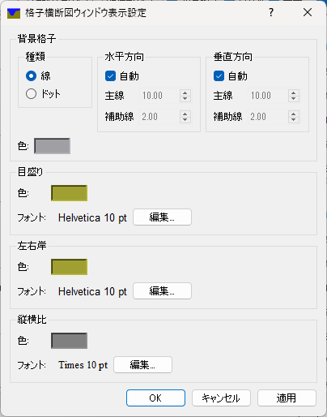

   断面データ表示設定ダイアログ

値の表示設定領域
-------------------

値の表示設定領域はウィンドウの右上に表示されます。

値の表示設定領域の表示例を :numref:`image_crosssection_value_display_setting` に示します。

.. _image_crosssection_value_display_setting:

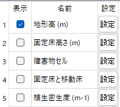

   断面データ表示ウィンドウ 値の表示設定領域

値の表示設定領域の機能を以下に示します。

表示
    チェックをつけると、その名前の値がメイン領域に表示されます。

名前
    値の名前を表示します。

設定
    ボタンを押すと、その名前の値の表示設定ダイアログ (:numref:`image_crosssection_value_setting_dialog` 参照) を表示します。ダイアログでの設定項目を以下に示します。

    表示
        チェックすると値がメイン領域に表示されます。
   
    モード
        表示方法を以下から選択します。

        標高のグラフ
            値を標高のグラフとして表示します。例を :numref:`image_crosssection_elevation_chart` に示します。基本的には標高や水面標高などの値の表示に使用します。

        個別のグラフ
            値をグラフとして表示します。標高や他の値とは別の個別のグラフで表示します。 例を :numref:`image_crosssection_independent_chart` に示します。

        カラーマップのグラフ
            値ごとに異なる色をつけた帯として表示します。主に障害物セルなどのフラグ値の表示に使用します。例を :numref:`image_crosssection_colormap` に示します。

    標高のグラフ 設定
        モードで「標高のグラフ」を選んだ時のみ有効です。線の色、幅、点の表示、インデックスの表示の設定が行えます。

    個別のグラフ 設定
        モードで「個別のグラフ」を選んだ時のみ有効です。グラフの高さ、線の色などの設定が行えます。

    個別のグラフ 設定
        モードで「個別のグラフ」を選んだ時のみ有効です。グラフの高さ、線の色などの設定が行えます。

.. _image_crosssection_value_setting_dialog:

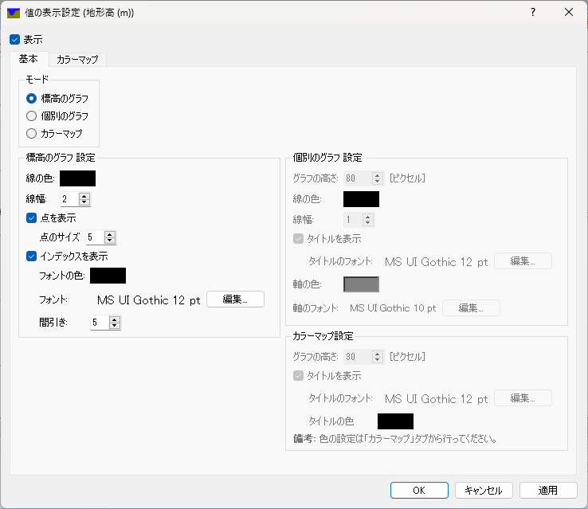

   断面データ表示ウィンドウ 値の表示設定ダイアログ

.. _image_crosssection_elevation_chart:

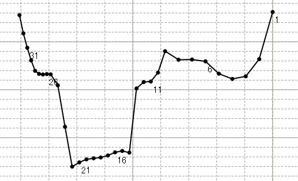

   標高のグラフ 表示例

.. _image_crosssection_independent_chart:

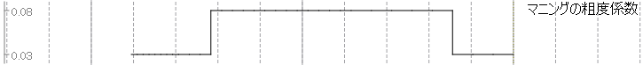

   個別のグラフ 表示例

.. _image_crosssection_colormap:

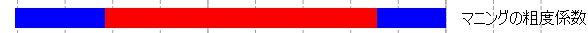

   カラーマップ 表示例

値の表示領域
-------------------

値の表示領域はウィンドウの右下に表示されます。

値の表示設定領域の表示例を :numref:`image_crosssection_values` に示します。この領域には、指定した断面での値が表示されます。

.. _image_crosssection_values:

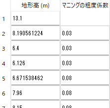

   断面データ表示ウィンドウ 値の表示設定領域

コントローラ
-------------------

コントローラはウィンドウの下部に表示されます。

コントローラの表示例を :numref:`image_crosssection_controller` に示します。コントローラでは
表示対象領域の変更などの操作が行えます。

コントローラの機能を以下に示します。

方向
    断面ウィンドウの横軸をI方向にするかJ方向にするかを指定します。

位置
    断面の位置を指定します。例えば方向が I方向で、位置が 1 の場合は、J = 1 での断面がが表示されます。

セル中心の値
    セル中心の値として、断面の線の上流側のセル、下流側のセルどちらを表示するかを指定します。

スナップショット
    断面ウィンドウのメインウィンドウのスナップショットを保存します。 :numref:`image_crosssection_snapshot` に示すダイアログが表示されるので、保存先のフォルダと断面を指定して「OK」ボタンを押します。
    
CSVエクスポート
    断面ウィンドウで表示しているデータをCSVファイルに保存します。 :numref:`image_crosssection_csvexport` に示すダイアログが表示されるので、保存先のフォルダと断面を指定して「OK」ボタンを押します。

.. _image_crosssection_controller:

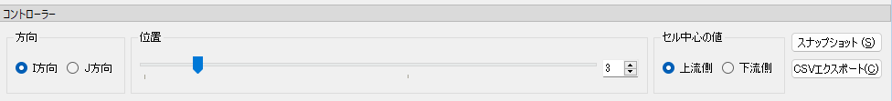

   断面データ表示ウィンドウ コントローラ

.. _image_crosssection_snapshot:

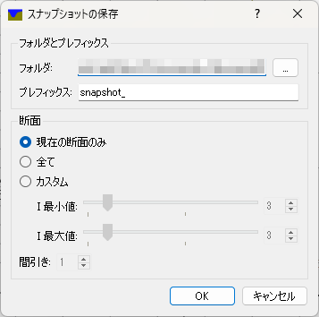

   断面データ表示ウィンドウ スナップショットの保存ダイアログ

.. _image_crosssection_csvexport:

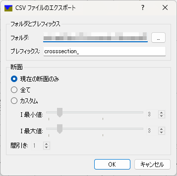

   断面データ表示ウィンドウ CSVファイルのエクスポートダイアログ

