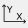
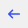
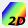

Toolbars
========

.. _sec_main_toolbar:

[Main Toolbar]
--------------

[Main Toolbar] handles file I/O, view setting operations for canvas,
solver launching and opening subwindows. :numref:`image_main_toolbar`
shows the [Main Toolbar].

.. _image_main_toolbar:

.. figure:: images/main_toolbar.png

   The [Main Toolbar]

:numref:`main_toolbar_items_table` describes the functions of the
items on the [Main Toolbar].

.. |icon_undo| image:: images/icon_undo.png
.. |icon_redo| image:: images/icon_redo.png

.. |icon_rotate_90| image:: images/icon_rotate_90.png
.. |icon_xy_plane| image:: images/icon_xy_plane.png
.. |icon_yz_plane| image:: images/icon_yz_plane.png
.. |icon_xz_plane| image:: images/icon_xz_plane.png

.. |icon_move_right| image:: images/icon_move_right.png
.. |icon_move_top| image:: images/icon_move_top.png
.. |icon_move_bottom| image:: images/icon_move_bottom.png
.. |icon_zoom_in| image:: images/icon_zoom_in.png
.. |icon_zoom_out| image:: images/icon_zoom_out.png
.. |icon_extend_x| image:: images/icon_extend_x.png
.. |icon_shorten_x| image:: images/icon_shorten_x.png
.. |icon_extend_y| image:: images/icon_extend_y.png
.. |icon_shorten_y| image:: images/icon_shorten_y.png
.. |icon_run| image:: images/icon_run.png

.. |icon_solver_console| image:: images/icon_solver_console.png
.. |icon_post2d| image:: images/icon_post2d.png

.. |icon_post3d| image:: images/icon_post3d.png
.. |icon_chart_window| image:: images/icon_chart_window.png
.. |icon_scatterd_chart| image:: images/icon_scatterd_chart.png
.. |icon_compare_measured| image:: images/icon_compare_measured.png

.. |icon_mouse_hints| image:: images/icon_mouse_hints.png

.. _main_toolbar_items_table:

.. list-table:: Functions of the items on the [Main Toolbar]
   :header-rows: 1

   * - Icon
     - Name
     - Description
   * - |icon_file_open|
     - [Open]
     - Opens a project file
   * - |icon_file_save|
     - [Save]
     - Saves the project.
   * - |icon_file_snapshot|
     - [Save Snapshot] (N)
     - Saves a snapshot of the active window.
   * - |icon_file_googleearth|
     - [Continuous Snapshots / Google Earth Export]
     - Saves images of each timestep produced by the Post-processing Window/Graph Window into image files, and outputs a KML file for Google Earth.
   * - |icon_undo|
     - Undo
     - Undoes the most recent action.
   * - |icon_redo|
     - Redo
     - Redoes the most recent undoed action.
   * - |icon_fit|
     - Fit
     - Zooms out such that everything is displayed in the window.
   * - |icon_reset_rotation|
     - Reset Rotation
     - Rotates the graphic such that the X-axis is pointing rightward (in the positive direction) and the Y-axis is pointing upward (in the positive direction).
   * - |icon_rotate_90|
     - 90-Degree Rotation
     - Rotates 90 degrees counterclockwise.
   * - |icon_xy_plane|
     - XY-plane
     - Rotates the graphic such that the X-axis is pointing rightward (in the positive direction) and the Y-axis is pointing upward (in the positive direction).
   * - |icon_yz_plane|
     - YZ-plane
     - Rotates the graphic such that the Y-axis is pointing rightward (in the positive direction) and the Z-axis is pointing upward (in the positive direction).
   * - |icon_xz_plane|
     - XZ-plane
     - Rotates the graphic such that the Z-axis is pointing rightward (in the positive direction) and the X-axis is pointing upward (in the positive direction).
   * - |icon_move_left|
     - Moves to the left
     - Shifts the viewpoint to the left.
   * - |icon_move_right|
     - Moves to the right
     - Shifts the viewpoint to the right.
   * - |icon_move_top|
     - Moves to the top
     - Shifts the viewpoint to the top.
   * - |icon_move_bottom|
     - Moves to the bottom
     - Shifts the viewpoint to the bottom.
   * - |icon_zoom_in|
     - [Zoom in]
     - Zooms in on the display.
   * - |icon_zoom_out|
     - [Zoom out]
     - Zooms out from the display.
   * - |icon_extend_x|
     - Extension in the X-axis direction
     - Extends only in the X-axis direction.
   * - |icon_shorten_x|
     - Shortening in the X-axis direction
     - Shortens only in the X-axis direction.
   * - |icon_extend_y|
     - Extension in the Y-axis direction
     - Extends only in the Y-axis direction.
   * - |icon_shorten_y|
     - Shortening in the Y-axis direction
     - Shortens only in the Y-axis direction.
   * - |icon_run|
     - [Run]
     - Starts the solver.
   * - |icon_stop|
     - [Stop]
     - Stops the solver.
   * - |icon_pre_processor|
     - Display Pre-processor
     - Opens [Pre-processor Window].
   * - |icon_solver_console|
     - Display [Solver Console]
     - Displays [Solver Console].
   * - |icon_post2d|
     - [Open New 2D Post-processing Window]
     - Opens a new [2D Post-processing Window].
   * - |icon_birdseye_post2d|
     - [Open New Bird’s Eye 2D Post-processing Window]
     - Opens a new [Bied’s Eye Post-processing Window].
   * - |icon_post3d|
     - [Open New 3D Post-processing Window]
     - Opens a new [3D Post-processing Window].
   * - |icon_chart_window|
     - [Open New Graph Window]
     - Opens a new [Graph Window].
   * - |icon_scatterd_chart|
     - [Open New Scattered Chart Window]
     - Opens a new [Scattered Chart Window]
   * - |icon_compare_measured|
     - [Compare with measured values]
     - Opens a dialog to compare calculation results with measured values
   * - |icon_reload_result|
     - [Reload Calculation Result]
     - Reloads calculation result.
   * - |icon_mouse_hints|
     - [Mouse Hints]
     - Displays the [Mouse Hints] dialog.

[Operation Toolbar]
----------------------

The [Operation Toolbar] is displayed only when the [Pre-processing
Window] is active.

The [Operation Toolbar] shows buttons for operations
available for the currently selected item in [Object Browser].
:numref:`image_operation_toolbar` shows the [Operation Toolbar].

.. _image_operation_toolbar:

.. figure:: images/operation_toolbar.png

   The [Operation Toolbar]

:numref:`operation_toolbar_items_table` describes the functions of the items on the [Operation
Toolbar].

.. |icon_move_up| image:: images/icon_move_up.png
.. |icon_move_down| image:: images/icon_move_down.png
.. |icon_delete| image:: images/icon_delete.png

.. _operation_toolbar_items_table:

.. list-table:: Functions of the items on the [Operation Toolbar]
   :header-rows: 1

   * - Icon
     - Name
     - Description
   * - |icon_move_up|
     - [Move Up]
     - Exchanges priorities with the item that is immediately higher in priority
   * - |icon_move_down|
     - [Move Down]
     - Exchanges priorities with the item that is immediately lower in priority
   * - |icon_delete|
     - [Delete]
     - Deletes the selected item.

[Animation Toolbar]
-------------------------

The [Animation Toolbar] is displayed only when a Post-processing Window
or Graph Window is active.

The [Animation Toolbar] items control
movements between timesteps of calculation results.
:numref:`image_animation_toolbar` shows the [Animation Toolbar].

.. _image_animation_toolbar:

.. figure:: images/animation_toolbar.png

   The [Animation Toolbar]

:numref:`animation_toolbar_items_table` describes the functions of the
items on the [Animation Toolbar].

.. |icon_movie_backword| image:: images/icon_movie_backword.png

.. |icon_move_toggle_follow| image:: images/icon_move_toggle_follow.png
.. |icon_movie_speed| image:: images/icon_movie_speed.png

.. _animation_toolbar_items_table:

.. list-table:: Functions of the items on the [Animation Toolbar]
   :header-rows: 1

   * - Icon
     - Name
     - Description
   * - |icon_movie_reset|
     - [Reset]
     - Moves to the first timestep.
   * - |icon_movie_backword|
     - [Step Backward]
     - Moves to the previous timestep.
   * - |icon_movie_start_stop|
     - [Start/Stop Animation]
     - Starts or stops the animation.
   * - |icon_movie_forward|
     - [Step Forward]
     - Moves to the next timestep.
   * - |icon_movie_last|
     - [Step Last]
     - Moves to the last timestep.
   * - |icon_move_toggle_follow|
     - [Toggle Following Last Step]
     - Automatically moves to the most recent timestep.
   * - |icon_movie_speed|
     - [Edit Slow Motion Animation Speed]
     - Sets the speed for animation.
