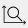

ツールバー
============

.. _sec_main_toolbar:

メインツールバー
----------------

メインツールバーには、ファイル操作、表示操作、ソルバー起動操作、ウィンドウの
表示操作などが含まれます。メインツールバーの表示例を
:numref:`image_main_toolbar` に示します。

.. _image_main_toolbar:

.. figure:: images/main_toolbar.png
   :width: 450pt

   メインツールバー

メインツールバーの各ボタンの機能を :numref:`main_toolbar_items_table` に示します。

.. |icon_file_open| image:: images/icon_file_open.png
.. |icon_file_save| image:: images/icon_file_save.png
.. |icon_file_snapshot| image:: images/icon_file_snapshot.png

.. |icon_file_googleearth| image:: images/icon_file_googleearth.png

.. |icon_fit| image:: images/icon_fit.png
.. |icon_reset_rotation| image:: images/icon_reset_rotation.png

.. |icon_xy_plane| image:: images/icon_xy_plane.png

.. |icon_move_left| image:: images/icon_move_left.png

.. |icon_extend_x| image:: images/icon_extend_x.png
.. |icon_shorten_x| image:: images/icon_shorten_x.png
.. |icon_extend_y| image:: images/icon_extend_y.png
.. |icon_shorten_y| image:: images/icon_shorten_y.png

.. |icon_stop| image:: images/icon_stop.png
.. |icon_pre_processor| image:: images/icon_pre_processor.png
.. |icon_solver_console| image:: images/icon_solver_console.png
.. |icon_post2d| image:: images/icon_post2d.png
.. |icon_birdseye_post2d| image:: images/icon_birdseye_post2d.png
.. |icon_post3d| image:: images/icon_post3d.png
.. |icon_chart_window| image:: images/icon_chart_window.png
.. |icon_scatterd_chart| image:: images/icon_scatterd_chart.png

.. |icon_reload_result| image:: images/icon_reload_result.png
.. |icon_mouse_hints| image:: images/icon_mouse_hints.png

.. _main_toolbar_items_table:

.. list-table:: メインツールバーのボタンの機能
   :header-rows: 1

   * - ボタン
     - タイトル
     - 説明
   * - |icon_file_open|
     - 開く
     - プロジェクトファイルを開きます
   * - |icon_file_save|
     - 保存
     - プロジェクトをファイルに保存します
   * - |icon_file_snapshot|
     - スナップショットを保存 (N)
     - アクティブなウィンドウを画像ファイルに保存します
   * - |icon_file_snapshot_clipboard|
     - スナップショットをクリップボードにコピー
     - アクティブなウィンドウの画像をクリップボードにコピーします
   * - |icon_file_googleearth|
     - 連続スナップショット / Google Earth 出力
     - 可視化ウィンドウ、グラフウィンドウを各タイムステップについて画像ファイルに保存し、Google Earth 用のKMLファイルを出力します
   * - |icon_undo|
     - アンドゥ
     - 直前の操作をアンドゥします
   * - |icon_redo|
     - リドゥ
     - 最後にアンドゥした操作を再び行います
   * - |icon_fit|
     - フィット
     - すべてのものが画面に収まるように調整します
   * - |icon_reset_rotation|
     - 回転のリセット
     - X軸が右向きに、Y軸が上向きになるように回転します
   * - |icon_rotate_90|
     - 90度回転
     - 90度回転します
   * - |icon_xy_plane|
     - XY平面
     - X軸が右向きに、Y軸が上向きになるように回転します
   * - |icon_yz_plane|
     - YZ平面
     - Y軸が右向きに、Z軸が上向きになるように回転します
   * - |icon_xz_plane|
     - ZX平面
     - Z軸が右向きに、X軸が上向きになるように回転します
   * - |icon_move_left|
     - 左に移動
     - 描画対象が左に移動するよう視点を移動します
   * - |icon_move_right|
     - 右に移動
     - 描画対象が右に移動するよう視点を移動します
   * - |icon_move_top|
     - 上に移動
     - 描画対象が上に移動するよう視点を移動します
   * - |icon_move_bottom|
     - 下に移動
     - 描画対象が下に移動するよう視点を移動します
   * - |icon_zoom_in|
     - 拡大
     - 拡大表示します
   * - |icon_zoom_out|
     - 縮小
     - 縮小表示します
   * - |icon_extend_x|
     - X方向に拡大
     - X軸方向についてのみ拡大します
   * - |icon_shorten_x|
     - X方向に縮小
     - X軸方向についてのみ縮小します
   * - |icon_extend_y|
     - Y方向に拡大
     - Y軸方向についてのみ拡大します
   * - |icon_shorten_y|
     - Y方向に縮小
     - Y軸方向についてのみ縮小します
   * - |icon_run|
     - 実行
     - ソルバーの実行を開始します
   * - |icon_stop|
     - 停止
     - 実行中のソルバーを停止します
   * - |icon_pre_processor|
     - プリプロセッサーを表示
     - プリプロセッサーを表示します
   * - |icon_solver_console|
     - ソルバーコンソールを表示
     - ソルバーコンソールを表示します
   * - |icon_post2d|
     - 新しい可視化ウィンドウ(2D) を開く
     - 新しい可視化ウィンドウ(2D) を開きます
   * - |icon_birdseye_post2d|
     - 新しい鳥瞰図可視化ウィンドウ(2D) を開く
     - 新しい鳥瞰図可視化ウィンドウ(2D) を開きます
   * - |icon_post3d|
     - 新しい可視化ウィンドウ (3D) を開く
     - 新しい可視化ウィンドウ(3D) を開きます
   * - |icon_chart_window|
     - 新しいグラフウィンドウを開く
     - 新しいグラフウィンドウを開きます
   * - |icon_scatterd_chart|
     - 新しい散布図ウィンドウを開く
     - 新しい散布図ウィンドウを開きます
   * - |icon_compare_measured|
     - 実測値と比較
     - 実測値と比較するダイアログを開きます
   * - |icon_reload_result|
     - 計算結果の再読み込み
     - 計算結果を読み込み直します
   * - |icon_mouse_hints|
     - マウスヒント
     - マウスヒントダイアログを表示します

操作ツールバー
---------------

操作ツールバーは、プリプロセッサーがアクティブな時のみ表示されます。

操作ツールバーには、プリプロセッサーのオブジェクトブラウザーで
現在選択された項目について行える操作が含まれます。操作ツールバーの表示例を
:numref:`image_operation_toolbar` に示します。

.. _image_operation_toolbar:

.. figure:: images/operation_toolbar.png
   :width: 50pt

   操作ツールバー

操作ツールバーの各ボタンの機能を :numref:`operation_toolbar_items_table` に示します。

.. |icon_move_up| image:: images/icon_move_up.png
.. |icon_move_down| image:: images/icon_move_down.png

.. _operation_toolbar_items_table:

.. list-table:: 操作ツールバーのボタンの機能
   :header-rows: 1

   * - ボタン
     - タイトル
     - 説明
   * - |icon_move_up|
     - 上へ移動
     - 選択されている項目を、上の項目と順序を入れ替えます
   * - |icon_move_down|
     - 下へ移動
     - 選択されている項目を、下の項目と順序を入れ替えます
   * - |icon_delete|
     - 削除
     - 選択されている項目を、削除します

.. _sec_animation_toolbar:

アニメーションツールバー
-------------------------

アニメーションツールバーは、可視化ウィンドウ、グラフウィンドウが
アクティブな時のみ表示されます。

アニメーションツールバーには、計算結果のタイムステップ間の
移動操作が含まれます。アニメーションツールバーの表示例を
:numref:`image_animation_toolbar` に示します。

.. _image_animation_toolbar:

.. figure:: images/animation_toolbar.png
   :width: 180pt

   アニメーションツールバー

アニメーションツールバーの各ボタンの機能を
:numref:`animation_toolbar_items_table` に示します。

.. |icon_movie_reset| image:: images/icon_movie_reset.png
.. |icon_movie_backword| image:: images/icon_movie_backword.png
.. |icon_movie_start_stop| image:: images/icon_movie_start_stop.png
.. |icon_movie_forward| image:: images/icon_movie_forward.png
.. |icon_movie_last| image:: images/icon_movie_last.png

.. _animation_toolbar_items_table:

.. list-table:: アニメーションツールバーのボタンの機能
   :header-rows: 1

   * - ボタン
     - タイトル
     - 説明
   * - |icon_movie_reset|
     - 先頭へ
     - 先頭のタイムステップに移動します
   * - |icon_movie_backword|
     - 一つ前へ
     - 一つ前のタイムステップに移動します
   * - |icon_movie_start_stop|
     - 開始／停止
     - 現在表示しているタイムステップから順に次のタイムステップに進んでいきます。
   * - |icon_movie_forward|
     - 一つ次へ
     - 一つ次のタイムステップに移動します
   * - |icon_movie_last|
     - 最後のステップへ
     - 最後のタイムステップに移動します
   * - |icon_move_toggle_follow|
     - 常に最後のステップを表示
     - ソルバーの計算の実行中に新しい計算結果が出力されるたびに、自動的に最後のタイムステップに移動します。
   * - |icon_movie_speed|
     - 再生速度を設定
     - 再生する時の速度を設定します。

|icon_movie_speed| ボタンを押すと、
アニメーション速度設定ダイアログ (:numref:`animation_speed_dialog` 参照)
が表示されます。タイムステップ間の描画間隔を設定して「OK」ボタンを押します。

.. _animation_speed_dialog:

.. figure:: images/animation_speed_dialog.png
   :width: 160pt

   アニメーション速度ダイアログ
