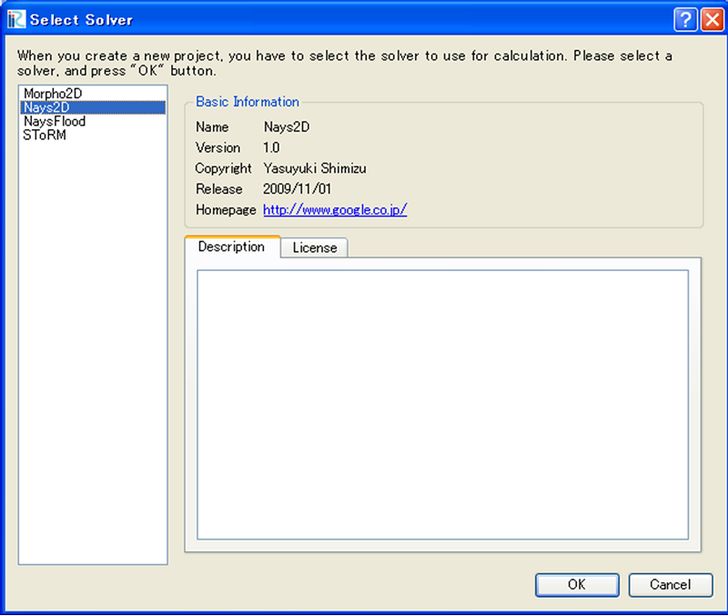
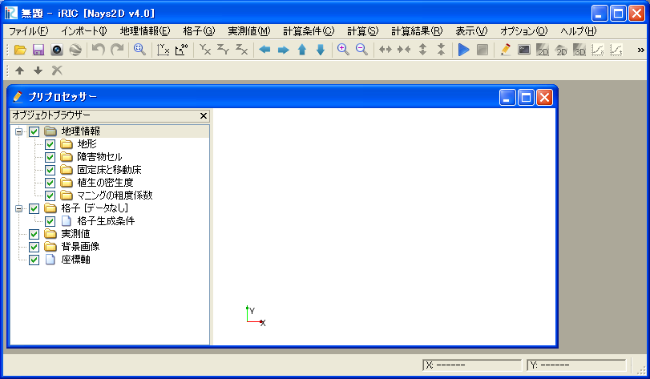

.. _sec_new_project:

新しいプロジェクト(N)
======================

新しいプロジェクトを開始します。

プロジェクトで利用するソルバーを選択するダイアログ
(:numref:`image_select_solver_dialog`)
が表示されますので、利用したいソルバーを選択して「OK」ボタンを押します。

編集中のデータがある時は、プロジェクトを保存するか確認する
ダイアログが表示されます。

新しいプロジェクトを開始すると、プリプロセッサーが表示されます。
新しいプロジェクトを開始した時の画面表示例を
:numref:`image_new_iric_window` に示します。

.. _image_select_solver_dialog:

   ソルバーの選択ダイアログ

.. _image_new_iric_window:

   プロジェクト開始後の iRIC 表示例
