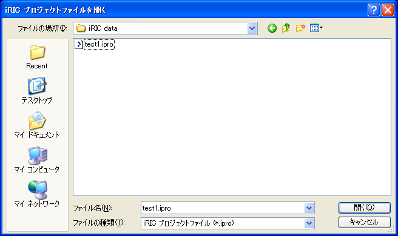

.. _sec_open_project:

開く(O)
===========

プロジェクトファイルを読み込みます。

iRICプロジェクトファイルを開くダイアログ（:numref:`image_open_project_file_dialog`
参照）が表示されますので、開きたいファイルを選択して「開く」ボタンを押します。
フォルダに保存したプロジェクトを開くには、
フォルダ内の project.xml ファイルを選択します。

編集中のデータがある時は、プロジェクトを保存するか確認するダイアログが表示されます。

プロジェクトファイルを開くと、プロジェクトを保存した時の画面構成が復元されます。

.. _image_open_project_file_dialog:

   iRICプロジェクトファイルを開くダイアログ
