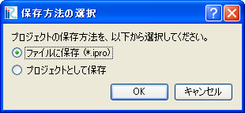

保存(S)
=========

プロジェクトファイルを保存します。

プロジェクトファイルを開いて作業していた場合や、既に一度プロジェクトファイルに
保存していた場合、プロジェクトファイルは上書き保存されます。

初めてプロジェクトを保存する場合は、 :numref:`image_how_to_save_dialog`
に示すダイアログが表示されますので、保存方法を選択して「OK」ボタンを押します。
それぞれの保存方法については、
:ref:`sec_file_save_as_ipro` 及び
:ref:`sec_file_save_as_project` を参照してください。

保存が成功すると、ステータスバーに :numref:`image_statusbar_after_saving`
に示すようなメッセージが表示されます。

.. _image_how_to_save_dialog:

   保存方法の選択ダイアログ

.. _image_statusbar_after_saving:

   プロジェクト保存時のステータスバー 表示例
