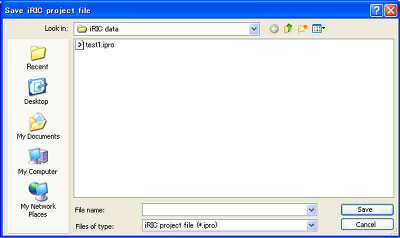

.. _sec_file_save_as_ipro:

名前をつけてファイルに保存 (\*.ipro) (A)
========================================

プロジェクトを、名前をつけてファイルに保存します。

iRICプロジェクトファイルを保存するダイアログ
(:numref:`image_save_iric_pro_file_dialog` 参照)
が表示されますので、保存するファイル名を指定して「保存」ボタンを押します。

保存が成功すると、ステータスバーに :numref:`image_statusbar_after_saving`
に示したようなメッセージが表示されます。

.. _image_save_iric_pro_file_dialog:

   iRIC プロジェクトファイルを保存ダイアログ 表示例
