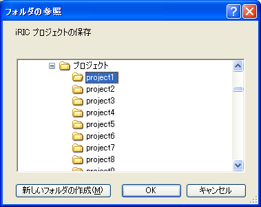

.. _sec_file_save_as_project:

[Save as Project] (P)
=======================

**Description**: Names and saves the project into a folder.

When you select [Save as Project], the [Browse For Folder] dialog
(:numref:`image_browse_for_folder_dialog`) will open. Select the
folder you want to save and click on [OK].

When the project is successfully saved, the message in
:numref:`image_statusbar_after_saving` will
appear on [Status Bar].

When you want to open the folder, select project.xml inside that folder.

.. _image_browse_for_folder_dialog:

   The [Browse For Folder] dialog
