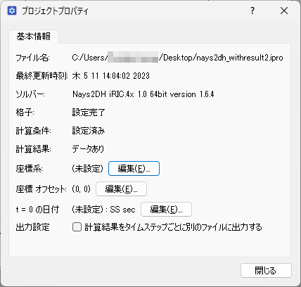
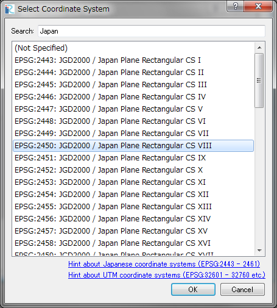
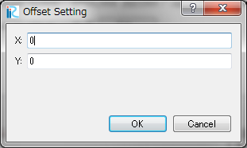

プロパティ (P)
===============

現在のプロジェクトに関するプロパティダイアログを表示します。

プロパティダイアログの表示例を :numref:`image_project_property_dialog`
に示します。

このダイアログから、座標系とオフセットを指定することができます。

「座標系」の横の「編集」ボタンを押すと、座標系の選択ダイアログ
(:numref:`image_select_coordsystem_dialog` 参照) が表示されます。ここから、
地理情報や格子で使用する座標系を選択して下さい。

「座標 オフセット」の横の「編集」ボタンを押すと、オフセット設定ダイアログ
(:numref:`image_offset_setting_dialog` 参照) が表示されます。ここから、
座標のオフセット値を入力して下さい。

座標系の原点から遠い位置にある地理情報や格子をプロジェクト内で利用する場合
(例えば、 UTM座標系を使用して赤道から遠く離れた領域のデータを扱う場合)、
オフセットを入力することにより、座標値に関する打切り誤差が減少して、データ処理の
精度が改善します。このようなケースでは、あなたが使用する地理情報や格子に
近い点の X, Y の値を入力して下さい。

.. _image_project_property_dialog:

   プロジェクトプロパティダイアログ

.. _image_select_coordsystem_dialog:

   座標系の選択ダイアログ

.. _image_offset_setting_dialog:

   オフセット設定ダイアログ
