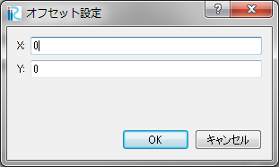
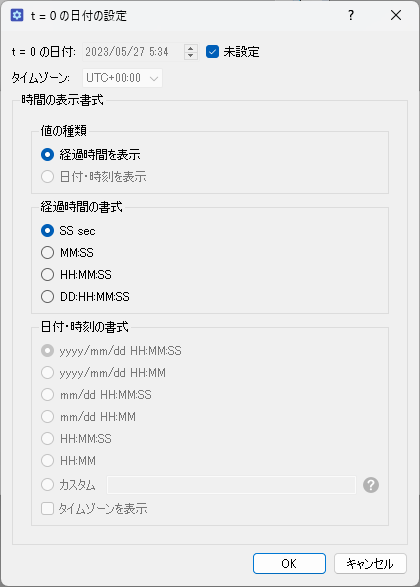

.. _sec_file_property:

[Property] (P)
===============

**Description**: Shows the property dialog of the current project.
:numref:`image_project_property_dialog` shows an example of
the [Project Property] dialog.

You can specify the followings from this dialog.

* Coordinate system
* Offset
* Date for t = 0

.. _image_project_property_dialog:

.. figure:: images/project_property_dialog.png
   :width: 280pt

   The [Project Property] dialog

[Coordinate System]
---------------------

When you click on [Edit] button next to [Coordinate System], the
dialog in :numref:`image_select_coordsystem_dialog` appears,
and you can choose the coordinate system
for your geographic data and grid.

.. _image_select_coordsystem_dialog:

.. figure:: images/select_coordsystem_dialog.png
   :width: 320pt

   The [Select Coordinate System] dialog

[Offset]
----------

When you click on [Edit] button next to [Coordinate Offset], the
dialog in :numref:`image_offset_setting_dialog` appears, and you can
input the offset for the coordinates.

When you want to use geographic data and grids very far from the origin
point of the coordinate system (for example, using UTM coordinate System
and handles geographic data far from equator), inputting offset will
reduce the truncation error. In such cases, please input the x and y
for some point near to your geographic data (or grid).

.. _image_offset_setting_dialog:

   The [Offset Setting] dialog

[Date for t = 0]
------------------

When you click on [Edit] button next to [Date for t = 0],
the dialog in :numref:`image_project_tzero_dialog` appears,
and you can edit the date for t = 0, and format to show time.

When date for t = 0 and format is specified, the setting is applied to
[Animation Toolbar] (:ref:`sec_animation_toolbar`),
[2D Post-processing Window] (:ref:`sec_vis2d_window_abst`) and
[3D Post-processing Window] (:ref:`sec_vis3d_window_abst`).

.. _image_project_tzero_dialog:

   [Date for t = 0 setting] dialog
