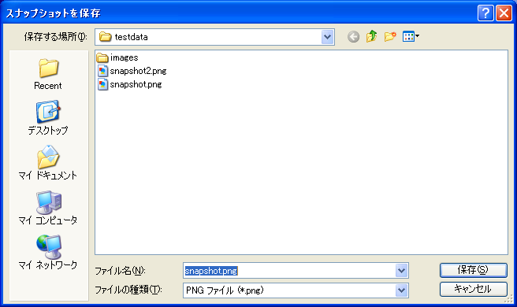

[Save Snapshot] (N)
=====================

**Description**: Saves a snapshot of the active window as an image file.

Snapshot can be saved to the following file formats.

* PNG file (\*.png)
* JPEG file (\*.jpg)
* Windows bitmap file (\*.bmp)
* EPS file(\*.eps)
* PDF file (\*.pdf)
* SVG file (\*.svg)

When you select [Save Snapshot], the [Save Snapshot] dialog
(:numref:`image_save_snapshot_dialog`) will open.
Input the file name and click on [Save].

.. _image_save_snapshot_dialog:

   The [Save Snapshot] dialog

.. note::

   When you save snapshot to EPS file, PDF file or SVG file, you can get hight quality
   image, because they are vector file format. We recommend you to use these file
   formats when you use iRIC snapshots for reasearch papers or reports.
