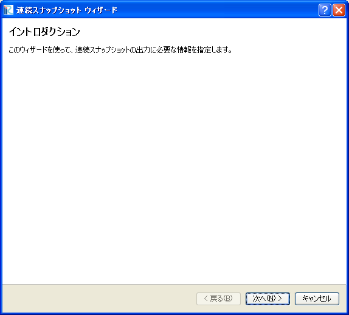
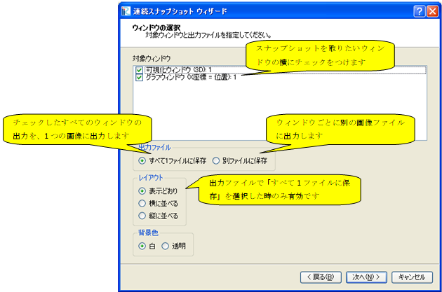

[Continuous Snapshots / Movie / Google Earth Export]
===============================================================

**Description**: Saves a time series of snapshots of the Post-processing
Window and Graph Window as image files. Movie file, KML file that can be
read by Google Earth can be output at the same time.
:numref:`continuous_snapshot_wizard1` to
:numref:`continuous_snapshot_wizard7` show examples of
each page of the [Continuous Snapshot Wizard].

When the settings in the wizard are completed, the [Continuous Snapshot]
dialog (:numref:`continuous_snapshot_dialog`) opens and
saving snapshots starts.

.. _continuous_snapshot_wizard1:

   The first screen of the [Continuous Snapshot Wizard]

.. _continuous_snapshot_wizard2:

   The second screen of the [Continuous Snapshot Wizard]

.. _continuous_snapshot_wizard3:

   The third screen of the [Continuous Snapshot Wizard]

.. _continuous_snapshot_wizard4:

.. figure:: images/continuous_snapshot_wizard4.png

   The forth screen of the [Continuous Snapshot Wizard]

.. _continuous_snapshot_wizard5:

.. figure:: images/continuous_snapshot_wizard5.png

   The fifth screen of the [Continuous Snapshot Wizard]

.. _continuous_snapshot_wizard6:

.. figure:: images/continuous_snapshot_wizard6.png

   The sixth screen of the [Continuous Snapshot Wizard]

.. _continuous_snapshot_wizard7:

.. figure:: images/continuous_snapshot_wizard7.png

   The seventh screen of the [Continuous Snapshot Wizard]

.. _continuous_snapshot_dialog:

   The [Continuous Snapshot] dialog
