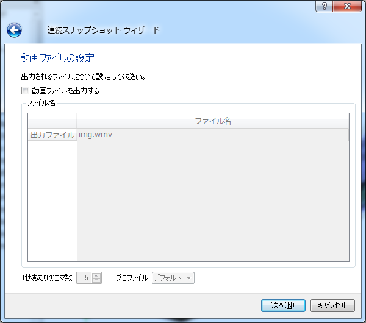
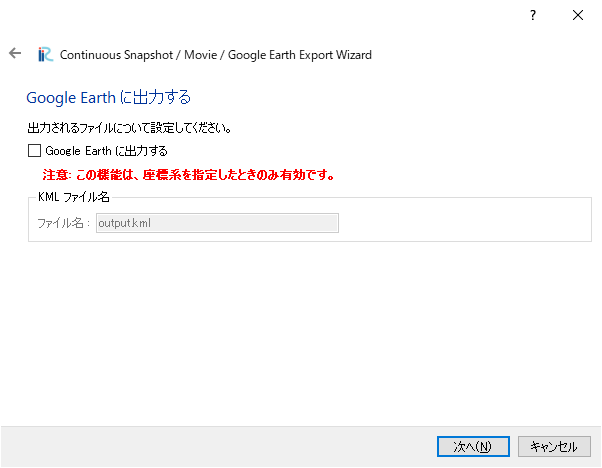

連続スナップショット / 動画 / Google Earth 出力
===============================================================

可視化ウィンドウ、グラフウィンドウの描画領域のスナップショットを、
複数のタイムステップについて画像ファイルに保存します。
また、動画ファイル、Google
Earth で読み込むことのできる KML ファイルを同時に出力します。

連続スナップショットのウィザードの各ページの表示例を
:numref:`continuous_snapshot_wizard1` ～
:numref:`continuous_snapshot_wizard7`
に示します。ウィザードでの設定を完了すると、
:numref:`continuous_snapshot_dialog`
に示したダイアログが表示され、連続スナップショットの保存が開始されます。

.. _continuous_snapshot_wizard1:

.. figure:: images/continuous_snapshot_wizard1.png
   :width: 340pt

   連続スナップショットウィザード 1ページ目

.. _continuous_snapshot_wizard2:

.. figure:: images/continuous_snapshot_wizard2.png
   :width: 380pt

   連続スナップショットウィザード 2ページ目

.. _continuous_snapshot_wizard3:

.. figure:: images/continuous_snapshot_wizard3.png
   :width: 340pt

   連続スナップショットウィザード 3ページ目

.. _continuous_snapshot_wizard4:

   連続スナップショットウィザード 4ページ目

.. _continuous_snapshot_wizard5:

   連続スナップショットウィザード 5ページ目

.. _continuous_snapshot_wizard6:

   連続スナップショットウィザード 6ページ目

.. _continuous_snapshot_wizard7:

   連続スナップショットウィザード 7ページ目

.. _continuous_snapshot_dialog:

.. figure:: images/continuous_snapshot_dialog.png
   :width: 200pt

   連続スナップショットダイアログ
