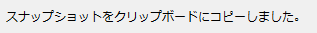

スナップショットをクリップボードにコピー
======================================================

現在アクティブなサブウィンドウのスナップショットを、クリップボードにコピーします。

コピーが成功すると、ステータスバーに :numref:`image_snapshot_clipboard_message`
に示すメッセージが表示されます。

.. _image_snapshot_clipboard_message:

   スナップショットのコピー完了メッセージ
