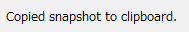

Copy Snapshot to Clipboard
============================

**Description**: Copies a snapshot of the active window to clipboard.

When the snapshot is copied to clipboard successfully,
message in :numref:`image_snapshot_clipboard_message`
is shown in the status bar.

.. _image_snapshot_clipboard_message:

   Message for copying snapshot to clipboard
