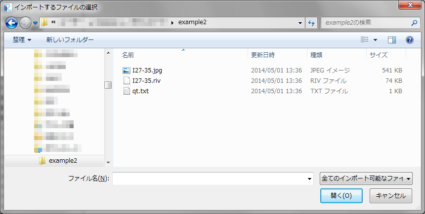
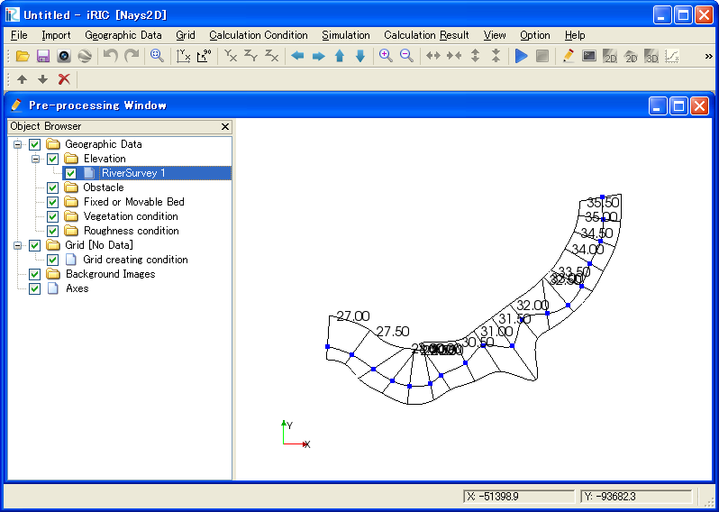
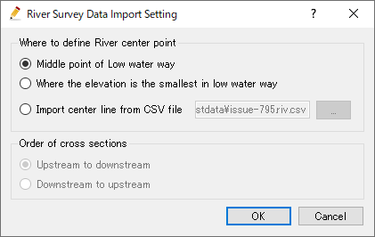
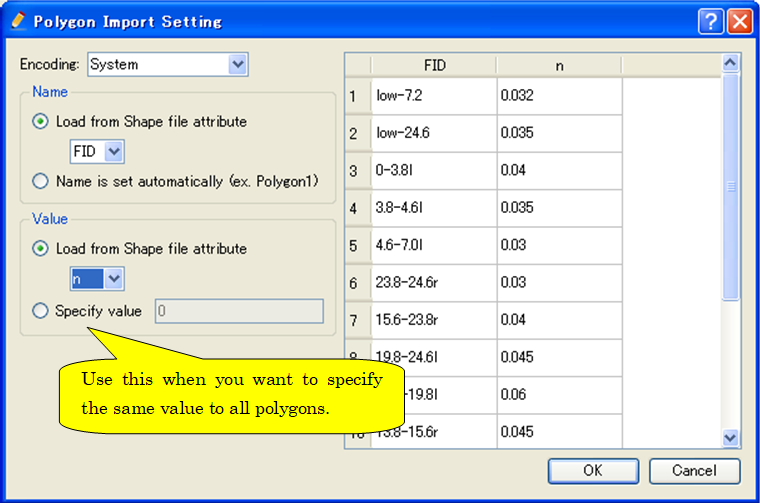

.. _sec_file_import_geo_data:

[Geographic Data] (E)
======================

**Description**: Imports geographic data.

When you select [Geographic Data], a list of importable geographic data
is shown as submenus. Select the geographic data you want to import and
the [Select file to import] dialog
(:numref:`image_select_file_to_import_dialog`) will open.
Select the file to import the geographic data.

You can see the imported geographic data in [Object Browser].
:numref:`image_iric_after_importing_riv_data` shows an example
of the iRIC window after importing a river survey data.

.. _image_select_file_to_import_dialog:

   The [Select file to import] dialog

.. _image_iric_after_importing_riv_data:

   iRIC window after importing a river survey data

When you import river survey data, the 
[River Survey Data Import Setting] dialog
(:numref:`image_rivdata_import_setting_dialog`) will open.
Specify the import setting and click on [OK].

.. _image_rivdata_import_setting_dialog:

   The [River Survey Data Import Setting] dialog

When you import ESRI shape files, the [Polygon Import Setting] dialog
(:numref:`image_polygon_import_setting_dialog`) will open.
Specify the import setting and click on [OK].

.. _image_polygon_import_setting_dialog:

   The [Polygon Import Setting] dialog
