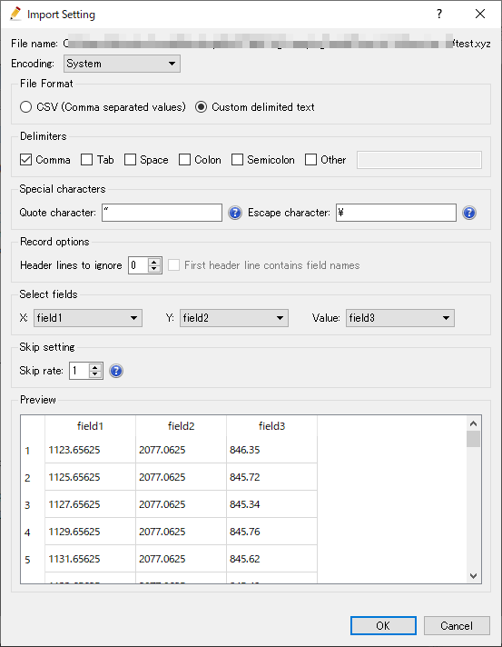
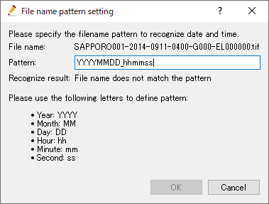

.. _sec_file_import_geo_data:

[Geographic Data] (E)
======================

**Description**: Imports geographic data.

Geographic data can be imported from file formats in :numref:`import_geodata_formats_table`.

.. _import_geodata_formats_table:

.. list-table:: Geographic data importable file formats
   :header-rows: 1

   * - Type
     - Format

   * - Point Cloud data
     - Topography file (\*.tpo)
   * -
     - Text file (\*.csv, \*.txt, \*.xyz)
   * -
     - STL file (\*.stl)
   * -
     - LandXML file (\*.xml)
   * - Cross-section data
     - Cross-section data (\*.riv)
   * - 
     - Japan MLIT Cross-secion data (\*.csv)
   * - Raster data
     - GeoTIFF file (\*.tif)
   * - 
     - Arc/Info ASCII file (\*.asc)
   * - 
     - NetCDF file (\*.nc)
   * - Time series raster data
     - GeoTIFF file (\*.tif)
   * - 
     - Arc/Info ASCII file (\*.asc)
   * - 
     - NetCDF file (\*.nc)
   * -
     - X band MP rader data (\*.\*)
   * - Polygons
     - ESRI Shapefile (\*.shp)
   * - 
     - CSV file (\*.csv)
   * - Lines
     - ESRI Shapefile (\*.shp)
   * - 
     - CSV file (\*.csv)
   * - Points
     - ESRI Shapefile (\*.shp)
   * - 
     - CSV file (\*.csv)

When you select [Geographic Data], a list of importable geographic data
is shown as submenus. Select the geographic data you want to import and
the [Select file to import] dialog
(:numref:`image_select_file_to_import_dialog`) will open.
Select the file to import the geographic data.

You can see the imported geographic data in [Object Browser].
:numref:`image_iric_after_importing_riv_data` shows an example
of the iRIC window after importing a river survey data.

.. _image_select_file_to_import_dialog:

   The [Select file to import] dialog

.. _image_iric_after_importing_riv_data:

.. figure:: images/iric_after_importing_riv_data.png
   :width: 360pt

   iRIC window after importing a river survey data

Additional operations dependent on file formats are explained below.

Topography file (\*.tpo)
---------------------------

When the file to import is selected, [Filtering Setting] dialog
(:numref:`image_tpo_import_setting_dialog`) is shown.

Please edit Filter value when needed, and click on [OK] button to proceed.

.. _image_tpo_import_setting_dialog:

   [Filtering Setting] dialog

Text file (\*.csv, \*.txt, \*.xyz)
----------------------------------------------

When you select a file, [Import Setting] dialog
(:numref:`image_import_pointcloud_setting_dialog`) is shown.

Please specify appropriate setting, checking [Preview] region, and click on [OK] button to proceed.

.. _image_import_pointcloud_setting_dialog:

   [Import Setting] dialog

Cross-section data (\*.riv)
-----------------------------

When you import cross-section data, the selected file is checked for errors.
If problems are found, [Problems Found in Data] dialog
(:numref:`image_rivdata_import_warning_dialog`) is shown.

After that, [Cross-Section Data Import Setting] dialog
(:numref:`image_rivdata_import_setting_dialog`) will open.
Specify the import setting and click on [OK].

.. _image_rivdata_import_warning_dialog:

.. figure:: images/rivdata_import_warning_dialog.png
   :width: 240pt

   [Problems Found in Data] dialog

.. _image_rivdata_import_setting_dialog:

.. figure:: images/rivdata_import_setting_dialog.png
   :width: 180pt

   The [Cross-Section Data Import Setting] dialog

Japan MLIT Cross-section data (\*.csv)
-----------------------------------------

At first, please select the CSV file that contains distance marker data.
Then [Select folder where cross section data exists] dialog is shown,
so select the folder and click on [Select Folder] button.

When importing from Japan MLIT Cross-section data, the file is checked for errors.
If problems are found, [Prolems Found in Data] dialog
() is shown.

After that, just like Cross-section data (\*.riv),
[Cross-Section Data Import Setting] dialog
(:numref:`image_rivdata_import_setting_dialog`) will open.
Specify the import setting and click on [OK].

.. _image_japan_csv_import_warning_dialog:

.. figure:: images/japan_riv_import_warning_dialog.png
   :width: 240pt

   [Problems Found in Data] dialog

GeoTIFF file (\*.tif), Arc/Info ASCII file (\*.asc) (Raster data)
-----------------------------------------------------------------------------

When you import GeoTIFF file (\*.tif), Arc/Info ASCII file (\*.asc) to import
raster data, if information about coordinate system is not included in
the file, [Warning] dialog (:numref:`image_geotiff_cs_warning_dialog`) is shown,
and [Select Coordinate System] dialog
(:numref:`image_geotiff_cs_select_dialog`) is shown.
Please select the coordinate system for the data to proceed.

.. _image_geotiff_cs_warning_dialog:

.. figure:: images/geotiff_cs_warning_dialog.png
   :width: 300pt

   [Warning] dialog
   
.. _image_geotiff_cs_select_dialog:

   [Select Coordinate System] dialog

GeoTIFF file (\*.tif), Arc/Info ASCII file (\*.asc) (Time series raster data)
------------------------------------------------------------------------------------

When you import GeoTIFF file (\*.tif), Arc/Info ASCII file (\*.asc) to import
time series raster data, time of date included in each file is recognized from
file names.

When the file name matches one of the following patterns, the files will be
imported automatically.

* YYYY-MM-DD_hh:mm:ss
* YYYY_MM_DD_hh:mm:ss
* YYYYMMDD-hhmmss
* YYYYMMDD_hhmmss
* YYYYMMDD-hhmm
* YYYYMMDD_hhmm

If the file name matches none of them, [File name pattern setting] dialog
(:numref:`image_geotiff_pattern_dialog`) is shown. Please input the pattern
to correctly recognize time values from file names.

.. _image_geotiff_pattern_dialog:

   [File name pattern setting] dialog

NetCDF file (\*.nc)
-----------------------

When you import NetCDF file into geographic data that has
dimensions other than position, the 
[Dimension Mapping Setting] dialog
(:numref:`image_netcdf_import_setting_dialog`) will open.
Setup the mapping setting about the dimensions, and click on [OK].

.. _image_netcdf_import_setting_dialog:

.. figure:: images/netcdf_import_setting_dialog.png
   :width: 160pt

   The [Dimension Mapping Setting] dialog

X band MP rader data (\*.\*)
--------------------------------

When you import XRAIN rainfall data as geographic data, save XRAIN rainfall 
data files into one foler, and select one of them in the dialog.
The, all rainfall data in that folder are loaded and imported.

ESRI Shapefile (\*.shp)
--------------------------------

When importing polygons or polylines from ESRI shape files,
[Polygon (or Polyline) Import Setting] dialog 
(:numref:`image_polygon_import_setting_dialog`) is shown.
Specify the setting for importing name and value, and click on [OK] to proceed.

.. _image_polygon_import_setting_dialog:

.. figure:: images/polygon_import_setting_dialog.png
   :width: 320pt

   [Polygon Import Setting] dialog
