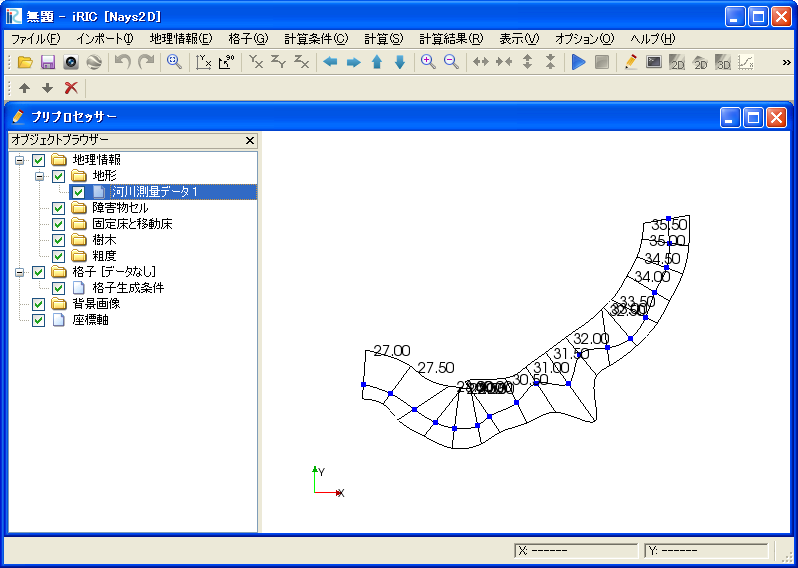
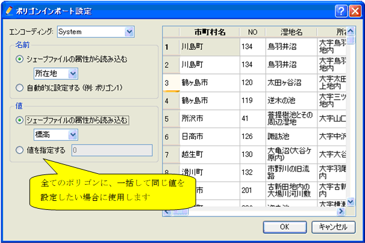

.. _sec_file_import_geo_data:

[Geographic Data] (E)
======================

**Description**: Imports geographic data.

Geographic data can be imported from the file formats below:

* River Survey data (\*.riv)
* Topography File (\*.tpo, \*.anc)
* RIC-Nays DEM data (\*.dat, \*.txt)
* USGS NED (\*.adf)
* STL file (\*.stl)
* ESRI Shape file (\*.shp) (Polygon)
* NetCDF file (\*.nc)
* GeoTIFF file (\*.tif)
* X band MP rader data (\*.\*)

When you select [Geographic Data], a list of importable geographic data
is shown as submenus. Select the geographic data you want to import and
the [Select file to import] dialog
(:numref:`image_select_file_to_import_dialog`) will open.
Select the file to import the geographic data.

You can see the imported geographic data in [Object Browser].
:numref:`image_iric_after_importing_riv_data` shows an example
of the iRIC window after importing a river survey data.

.. _image_select_file_to_import_dialog:

.. figure:: images/select_file_to_import_dialog.png
   :width: 400pt

   The [Select file to import] dialog

.. _image_iric_after_importing_riv_data:

   iRIC window after importing a river survey data

When you import river survey data, the 
[River Survey Data Import Setting] dialog
(:numref:`image_rivdata_import_setting_dialog`) will open.
Specify the import setting and click on [OK].

.. _image_rivdata_import_setting_dialog:

   The [River Survey Data Import Setting] dialog

When you import ESRI shape files, the [Polygon Import Setting] dialog
(:numref:`image_polygon_import_setting_dialog`) will open.
Specify the import setting and click on [OK].

.. _image_polygon_import_setting_dialog:

   The [Polygon Import Setting] dialog

When you import NetCDF file into geographic data that has
dimensions other than position, the 
[Dimension Mapping Setting] dialog
(:numref:`image_netcdf_import_setting_dialog`) will open.
Setup the mapping setting about the dimensions, and click on [OK].

.. _image_netcdf_import_setting_dialog:

.. figure:: images/netcdf_import_setting_dialog.png
   :width: 160pt

   The [Dimension Mapping Setting] dialog

When you import XRAIN rainfall data as geographic data, save XRAIN rainfall 
data files into one foler, and select one of them in the dialog.
The, all rainfall data in that folder are loaded and imported.
