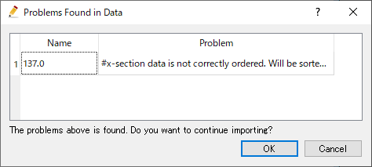
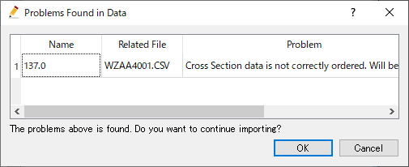
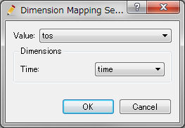

.. _sec_file_import_geo_data:

地理情報 (E)
======================

地理情報をインポートします。

地理情報は、:numref:`import_geodata_formats_table` に示す
ファイルフォーマットからインポートできます。

.. _import_geodata_formats_table:

.. list-table:: 地理情報をインポート可能なファイルフォーマット
   :header-rows: 1

   * - 種類
     - フォーマット
   * - 点群データ
     - 地勢データ (\*.tpo)
   * - 
     - テキストファイル (\*.csv, \*,txt, \*.xyz)
   * -
     - STLファイル (\*.stl)
   * -
     - LandXML ファイル (\*.xml)
   * - 横断測量データ
     - 横断測量データ (\*.riv)
   * - 
     - 国土交通省 横断測量データ (\*.csv)
   * - ラスターデータ
     - GeoTIFF ファイル (\*.tif)
   * - 
     - Arc/Info ASCII ファイル (\*.asc)
   * - 
     - NetCDF ファイル (\*.nc)
   * - 時系列ラスターデータ
     - GeoTIFF ファイル (\*.tif)
   * - 
     - Arc/Info ASCII ファイル (\*.asc)
   * -
     - NetCDFファイル (\*.nc)
   * -
     - XバンドMPレーダーデータ (\*.\*)
   * - ポリゴンデータ
     - ESRI シェープファイル (\*.shp)
   * -
     - CSV ファイル (\*.csv)
   * - ラインデータ
     - ESRI シェープファイル (\*.shp)
   * -
     - CSV ファイル (\*.csv)
   * - 点データ
     - ESRI シェープファイル (\*.shp)
   * -
     - CSV ファイル (\*.csv)

「地理情報」を選択すると、インポート可能な地理情報のリストが
サブメニューとして表示されます。ここでインポートしたい地理情報を選択すると、
:numref:`image_select_file_to_import_dialog`
に示すダイアログが表示されます。ファイルを選択すると、
選択したファイルから地理情報がインポートされます。

インポートされた地理情報は、オブジェクトブラウザーで確認できます。インポート後の
iRIC の表示例を :numref:`image_iric_after_importing_riv_data` に示します。

.. _image_select_file_to_import_dialog:

.. figure:: images/select_file_to_import_dialog.png
   :width: 400pt

   インポートするファイルの選択ダイアログ

.. _image_iric_after_importing_riv_data:

.. figure:: images/iric_after_importing_riv_data.png
   :width: 360pt

   河川測量データインポート後の iRIC 表示例

以下に、インポートするフォーマットごとの追加の操作について説明します。

地勢データ (\*.tpo)
----------------------

ファイルを選択すると、 :numref:`image_tpo_import_setting_dialog`
に示すダイアログが表示されます。

必要に応じて「間引き」の値を変更した上で「OK」ボタンを押します。

.. _image_tpo_import_setting_dialog:

.. figure:: images/tpo_import_setting_dialog.png
   :width: 200pt

   間引き設定ダイアログ

横断測量データ (\*.riv)
-----------------------

河川測量データからインポートする場合、ファイル選択後に
ファイルのエラーチェックが行われます。もし問題があった場合は、
:numref:`image_rivdata_import_warning_dialog` に示すダイアログが表示されます。

その後、:numref:`image_rivdata_import_setting_dialog`
に示すダイアログが表示されます。
インポートの設定を行って「OK」ボタンを押します。

.. _image_rivdata_import_warning_dialog:

   見つかった問題一覧ダイアログ

.. _image_rivdata_import_setting_dialog:

.. figure:: images/rivdata_import_setting_dialog.png
   :width: 180pt

   河川測量データインポート設定ダイアログ

国土交通省 横断測量データ (\*.csv)
---------------------------------------------

まずはじめに距離標データが格納された CSV ファイルを選択します。
その後、横断データのあるフォルダを選択するダイアログが表示されるので、
選択して「フォルダの選択」ボタンを押します。

日本 国土交通省 河川測量データからインポートする場合、ファイル選択後に
ファイルのエラーチェックが行われます。もし問題があった場合は、
:numref:`image_japan_csv_import_warning_dialog` に示すダイアログが表示されます。

その後、河川測量データ (\*.riv) と同じく、:numref:`image_rivdata_import_setting_dialog`
に示すダイアログが表示されます。
インポートの設定を行って「OK」ボタンを押します。

.. _image_japan_csv_import_warning_dialog:

   見つかった問題一覧ダイアログ

GeoTIFF ファイル (\*.tif), Arc/Info ASCII ファイル (\*.asc) (ラスターデータ)
-----------------------------------------------------------------------------

GeoTIFF ファイル (\*.tif), Arc/Info ASCII ファイル (\*.asc) からラスターデータを
インポートする場合、ファイルに座標系の情報が含まれていない場合、
:numref:`image_geotiff_cs_warning_dialog` に示すダイアログを表示した後、
:numref:`image_geotiff_cs_select_dialog` に示すダイアログが表示されます。
このダイアログで座標系を選択すると、その座標系でデータがインポートされます。

.. _image_geotiff_cs_warning_dialog:

   警告ダイアログ 表示例

.. _image_geotiff_cs_select_dialog:

.. figure:: images/geotiff_cs_select_dialog.png
   :width: 280pt

   座標系選択ダイアログ 表示例

GeoTIFF ファイル (\*.tif), Arc/Info ASCII ファイル (\*.asc) (時系列ラスターデータ)
------------------------------------------------------------------------------------

GeoTIFF ファイル (\*.tif), Arc/Info ASCII ファイル (\*.asc) から時系列ラスターデータを
インポートする場合、ファイル名から含まれるデータの時刻が認識されます。

ファイル名に以下のパターンが含まれている場合、自動的に認識されてインポートされます。

* YYYY-MM-DD_hh:mm:ss
* YYYY_MM_DD_hh:mm:ss
* YYYYMMDD-hhmmss
* YYYYMMDD_hhmmss
* YYYYMMDD-hhmm
* YYYYMMDD_hhmm

上記パターンに当てはまらない場合、:numref:`image_geotiff_pattern_dialog` に
示すダイアログが表示されます。ファイル名から時刻を認識するためのパターンを入力して
下さい。

.. _image_geotiff_pattern_dialog:

.. figure:: images/geotiff_pattern_dialog.png
   :width: 280pt

   ファイル名パターン設定ダイアログ 表示例

NetCDF ファイル (\*.nc)
-----------------------

NetCDF ファイルを、時間など位置以外の次元を持つ地理情報にインポートする
場合、ファイル選択後に
:numref:`image_netcdf_import_setting_dialog` に示すダイアログが表示されます。
次元のマッピングに関する設定を行い、「OK」ボタンを押します。

.. _image_netcdf_import_setting_dialog:

   次元のマッピング設定ダイアログ

XバンドMPレーダーデータ (\*.\*)
----------------------------------

XRAINの雨量データを地理情報にインポートする場合、一つのフォルダ内に XRAIN の
雨量データファイルのみが含まれているように保存し、それらのファイルの1つを選択します。
すると、そのフォルダ内に保存された全ての雨量データファイルが読み込まれ、インポートされます。

ESRI シェープファイル (\*.shp)
--------------------------------

ESRI シェープファイルからポリゴンデータ、ラインデータ、点データをインポートする
場合、ファイル選択後に :numref:`image_polygon_import_setting_dialog`
に示すダイアログが表示されます。

インポートの設定を行って「OK」ボタンを押します。

.. _image_polygon_import_setting_dialog:

.. figure:: images/polygon_import_setting_dialog.png
   :width: 320pt

   ポリゴンインポート設定ダイアログ
