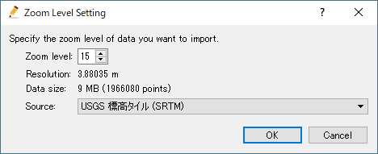
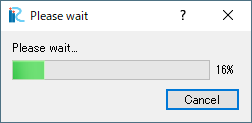

.. _sec_file_import_geo_data_from_web:

[Geographic Data (from web)]
================================

**Description**: Imports geographic data from web services

When you select [Geographic Data], a list of importable geographic data
is shown as submenus. Currently only Elevation data can be imported from web.

Please follow the steps below, to import geographic data from web.

1. Select the geographic data.

2. If you've not specified the coordinate system for the project,
   the [Select Coordinate System] dialog
   (:numref:`image_select_coordsystem_dialog`) is shown. Please select coordinate
   system and click on [OK] button.

3. [Select Region] dialog
   (:numref:`image_geo_web_select_region_dialog`) is shown.
   Use the following operations to select the region, and click on [Next]:

   * Ctrl + Left-dragging to Pan the map.
   * Ctrl + Middle-dragging to Zoom in/out the map. You also can use
     [Zoom In] and [Zoom Out] buttons.
   * Left-dragging to select region. The selected region is shown as a box with
     black line.

4. Click on [Next] button, and the [Zoom Level Setting] dialog is shown.
   In this dialog, you can change the setting like below:

   * You can select [Zoom level]. If you change the setting, you can review
     the abstract resolution and the size of data you are going to download,
     with [Resolution] and [Data size].
     The default value of the [Zoom level] is the maximum value, so that user
     usually use the data with the highest resolution.

   * You can select [Source]. Usually SRTM data distributed by USGS is used,
     but for example in Japan, you can choose geographic data distributed by GSI.

5. Click on [OK], iRIC starts downloading, dialog in
   :numref:`image_geo_web_pleasewait_dialog` is shown.

6. When the downloading finishes, the dialog disappears, and the downloaded
   geographic data is shown like :numref:`image_geo_web_example`.

.. _image_geo_web_select_region_dialog:

.. figure:: images/geo_web_select_region_dialog.png
   :width: 340pt

   The [Select Region] dialog

.. _image_geo_web_select_zoomlevel_dialog:

   The [Zoom Level Setting] dialog

.. _image_geo_web_pleasewait_dialog:

   The [Please wait] dialog

.. _image_geo_web_example:

.. figure:: images/geo_web_example.png
   :width: 360pt

   Example of imported geographic data
