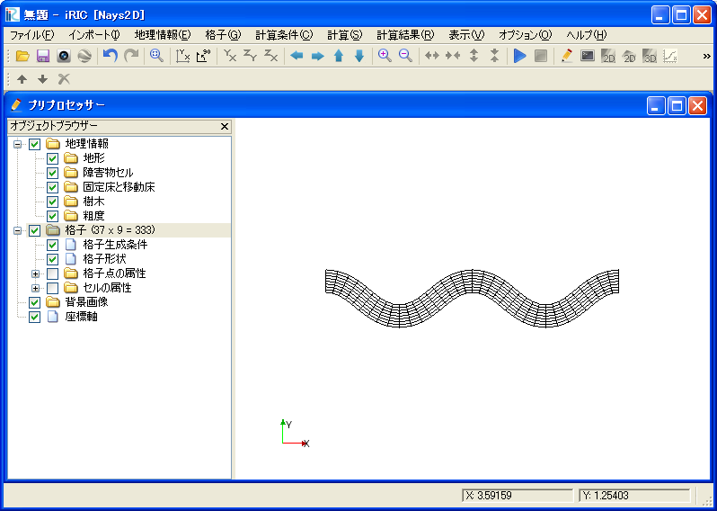

.. _sec_file_import_grid:

[Grid] (G)
===========

**Description**: Imports a grid.

When you select [Grid], the [Select file to import] dialog
(:numref:`image_select_file_to_import_dialog_for_grid`)
will open. Select the file you want to import and click on [Open].
:numref:`image_iric_after_importing_grid` shows the iRIC window
after importing a grid.

.. _image_select_file_to_import_dialog_for_grid:

.. figure:: images/select_file_to_import_dialog_for_grid.png

   The [Select file to import] dialog

.. _image_iric_after_importing_grid:

   The iRIC window after importing a grid
