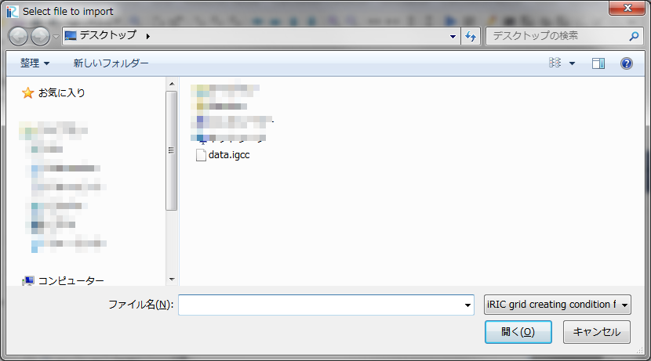

.. _sec_file_import_gridcreatingcond:

格子生成条件 (I)
=====================

格子生成条件をインポートします。

インポートするファイルを選択するダイアログ
(:numref:`image_select_file_to_import_dialog_for_gridcreatingcond` 参照)
が表示されますので、インポートするファイルを選択して
「開く」ボタンを押します。

インポート後の iRIC の表示例を
:numref:`image_iric_after_importing_gridcreatingcond` に示します。

.. _image_select_file_to_import_dialog_for_gridcreatingcond:

   インポートするファイルの選択ダイアログ

.. _image_iric_after_importing_gridcreatingcond:

   格子生成条件インポート後の iRIC 表示例
