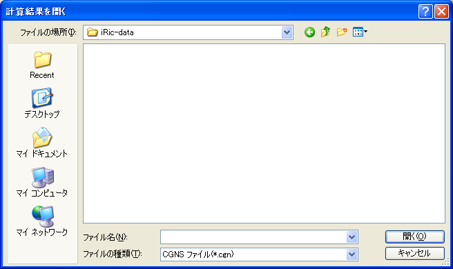

.. _sec_file_import_calc_result:

[Calucation Result] (R)
========================

**Description**: Imports the calculation result.

When you select [Calculation Result], the [Open Calculation result]
dialog
(:numref:`image_open_calc_result_dialog`) will open. Select the file you
want to import and click on [Open].

.. _image_open_calc_result_dialog:

   The [Open Calculation result] dialog

When importing a calculation result succeeded, a new project is started
with the imported CGNS file.
