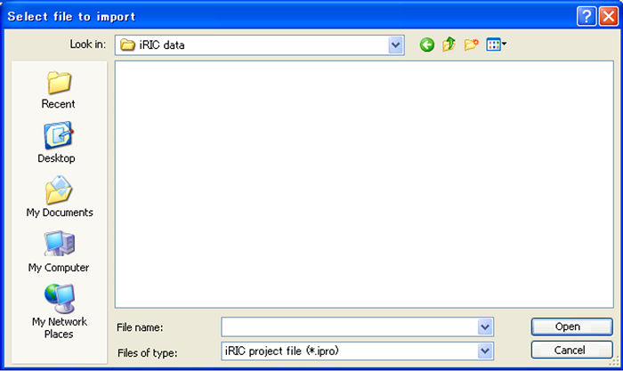

.. _sec_file_import_calc_cond:

計算条件 (C)
=============

計算条件をインポートします。

計算条件は、以下のファイルフォーマットからインポートできます。

* iRIC プロジェクトファイル (\*.ipro)
* CGNS ファイル (\*.cgn)
* YAMLファイル (\*.yml)

インポートするファイルを選択するダイアログ
(:numref:`image_select_file_to_import_dialog_for_cc` 参照)
が表示されますので、インポートするファイルを選択して「開く」ボタンを押します。

インポートが成功すると、「計算条件のインポートが成功しました」と
表示されたダイアログが表示されます。

.. _image_select_file_to_import_dialog_for_cc:

   インポートするファイルの選択ダイアログ
