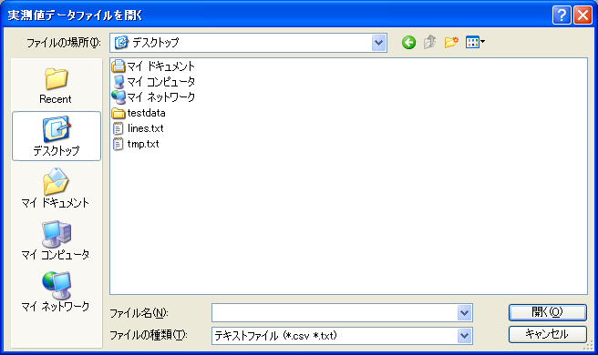

.. _sec_file_import_measured_data:

実測値 (M)
===========

実測値をインポートします。

インポートするファイルを選択するダイアログ
(:numref:`open_measured_data_dialog`)
が表示されますので、インポートするファイルを選択して「開く」ボタンを押します。

インポートが成功すると、オブジェクトブラウザーにインポートされたデータが
「実測値」の下に表示されます。インポートする実測値テキストファイルの
フォーマットについては
:ref:`sec_measured_data_text` を参照してください。

.. _open_measured_data_dialog:

   インポートするファイルの選択ダイアログ
