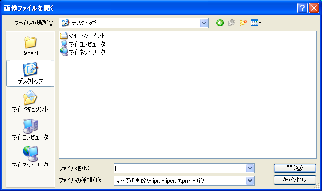

.. _sec_file_import_background_img:

背景画像 (B)
============

背景画像をインポートします。

インポートするファイルを選択するダイアログ
(:numref:`image_open_image_file_dialog` 参照)
が表示されますので、インポートするファイルを選択して
「開く」ボタンを押します。

インポートが成功すると、オブジェクトブラウザーにインポートされた画像が表示されます。

.. _image_open_image_file_dialog:

   インポートするファイルの選択ダイアログ
