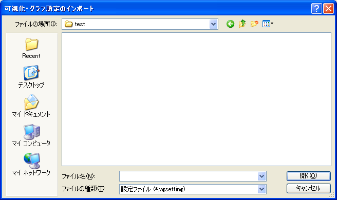

.. _sec_file_import_vis_setting:

[Visualization/Graph Settings] (V)
===================================

**Description**: Imports the settings of visualization windows and graph
windows.

When you select [Visualization/Graph Settings], the [Import
Visualization/Graph Settings] dialog
(:numref:`image_import_vis_setting_dialog`) will open. Select the
file you want to open and click on [Open]. When the file is successfully
imported, visualization windows and graph windows will open.

.. _image_import_vis_setting_dialog:

   The [Import Visualization/Graph Settings] dialog
