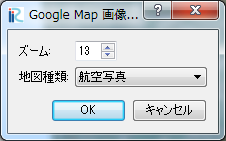

.. _sec_file_import_background_img_googlemap:

Google Map 背景画像 (O)
==============================

Google Map の航空写真を、背景画像としてインポートします。

インポートの設定を行うダイアログ
(:numref:`image_googlemap_img_import_setting_dialog` 参照)
がインポートの設定を必要に応じて変更して、「OK」ボタンを押します。

インポートが成功すると、オブジェクトブラウザーにインポートされた画像が表示されます。

.. _image_googlemap_img_import_setting_dialog:

   Google Map 背景画像インポート設定ダイアログ
