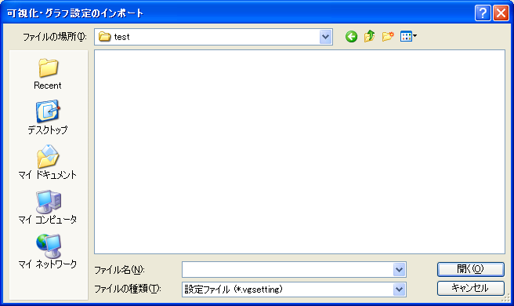

.. _sec_file_import_vis_setting:

可視化・グラフ設定 (V)
===================================

可視化ウィンドウ・グラフウィンドウの設定をインポートします。

インポートするファイルを選択するダイアログ
(:numref:`image_import_vis_setting_dialog`)
が表示されますので、インポートするファイルを選択して「開く」ボタンを押します。

インポートが成功すると、設定内容に従って可視化ウィンドウやグラフウィンドウが開きます。

.. _image_import_vis_setting_dialog:

   インポートするファイルの選択ダイアログ
