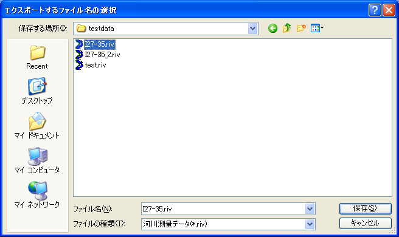

.. _sec_file_export_geo_data:

[Geographic Data] (E)
======================

**Description**: Exports geographic data.

Geographic data can be exported to the file formats in :numref:`export_geodata_formats_table`.

.. _export_geodata_formats_table:

.. list-table:: Geographic data exportable file formats
   :header-rows: 1

   * - Type
     - Format

   * - Point cloud data
     - Topography file (\*.tpo)
   * -
     - LandXML file (\*.xml)
   * -
     - STL file (\*.stl)
   * -
     - VTK file (\*.vtk)

   * - Cross-section data
     - River Survey data (\*.riv)
   * - 
     - Text file (\*.txt)
   * - 
     - CSV file (\*.csv)
   * -
     - LandXML file (\*.xml)

   * - Raster data
     - GeoTIFF file (\*.tif)
   * - 
     - Arc/Info ASCII file (\*.asc)
   * - 
     - 16bit grayscale PNG file (\*.png)
   * - 
     - NetCDF file (\*.nc)

   * - Time series raster data
     - NetCDF file (\*.nc)

   * - Polygons
     - ESRI Shapefile (\*.shp)
   * - 
     - CSV file (\*.csv)

   * - Lines
     - ESRI Shapefile (\*.shp)
   * - 
     - CSV file (\*.csv)

   * - Points
     - ESRI Shapefile (\*.shp)
   * - 
     - CSV file (\*.csv)

When you select [Geographic Data], a list of exportable geographic data
is shown as submenus. Select the geographic data you want to export and
the [Select file to export] dialog
(:numref:`image_select_file_to_export_dialog_for_geo_data`) will open.
Input the file name to export and click on [Save].

.. _image_select_file_to_export_dialog_for_geo_data:

   The [Select file to export] dialog
