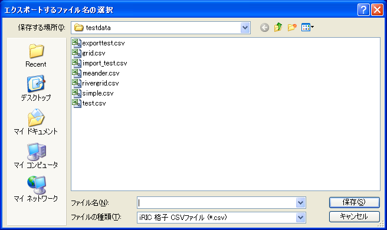

.. _sec_file_export_grid:

[Grid] (G)
===========

**Description**: Exports a grid.

When you select [Grid], the [Select file to export] dialog
(:numref:`image_select_file_to_export_dialog_for_grid`)
will open. Input the file name you want to export and click on [Save].

.. _image_select_file_to_export_dialog_for_grid:

   The [Select file to export] dialog
